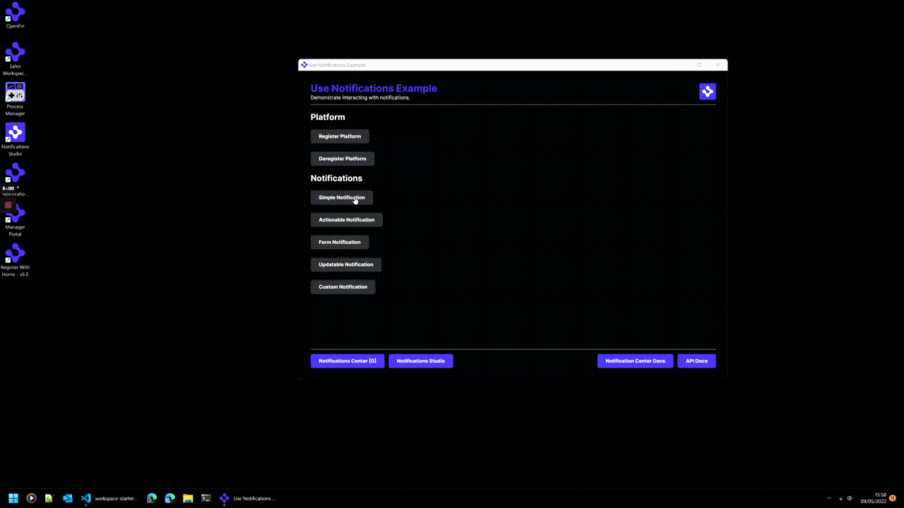

>**_:information_source: OpenFin Workspace:_** [OpenFin Workspace](https://www.openfin.co/workspace/) is a commercial product and this repo is for evaluation purposes (See [LICENSE.MD](LICENSE.MD)). Use of the OpenFin Container and OpenFin Workspace components is only granted pursuant to a  license from OpenFin (see [manifest](public/manifest.fin.json)). Please [**contact us**](https://www.openfin.co/workspace/poc/) if you would like to request a developer evaluation key or to discuss a production license.
OpenFin Workspace is currently **only supported on Windows** although you can run the sample on a Mac for development purposes.

# Use Notifications

OpenFin Notifications allow your applications to display and interact with notifications in a common environment.

This application you are about to install is a simple example of plugging in your own content or app. This example assumes you have already [set up your development environment](https://developers.openfin.co/of-docs/docs/set-up-your-dev-environment)

The example is a simple view that shows launching, interacting and auditing notifications.

---
**Running the Sample**

To run this sample you can:

* Clone this repo and follow the instructions below. This will let you customize the sample to learn more about our APIs.
* Launch the Github hosted version of this sample to interact with it by going to the following link: <a href="https://start.openfin.co/?manifest=https%3A%2F%2Fbuilt-on-openfin.github.io%2Fworkspace-starter%2Fworkspace%2Fv8.0.0%2Fuse-notifications%2Fmanifest.fin.json" target="_blank">Github Workspace Starter Use Notifications</a>

---


## Getting Started

1. Install dependencies. Note that these examples assume you are in the sub-directory for the example.

```bash
$ npm install
```

2. Build the project.

```bash
$ npm run build
```

3. Optional (if you wish to pin the version of OpenFin Workspace to version 8.0.0) - Set Windows registry key for [Desktop Owner Settings](https://developers.openfin.co/docs/desktop-owner-settings).
   This example includes a utility (`desktop-owner-settings.bat`) that adds the Windows registry key for you, pointing to a local desktop owner 
   settings file so you can test these settings. If you already have a desktop owner settings file, this script prompts to overwrite the location. Be sure to capture the existing location so you can update the key when you are done using this example.

  
   (**WARNING**: This script kills all open OpenFin processes. **Do not use this in production to close apps as force killing processes could kill an application while it's trying to save state/perform an action**).


```bash
$ npm run dos
```

4. Start the test server in a new window.

```bash
$ start npm run start
```

5. Start the demonstration application.

```bash
$ npm run client
```




### Read more about [working with Workspace](https://developers.openfin.co/of-docs/docs/overview-of-workspace).
