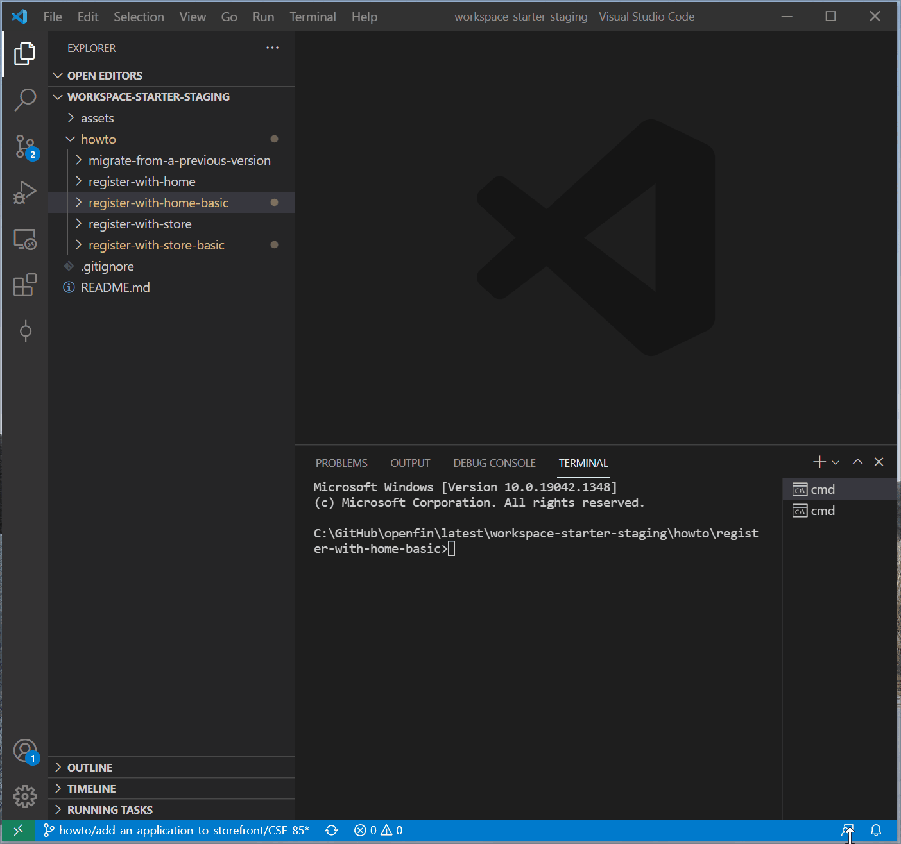

> **_:information_source: HERE Core UI:_** [HERE Core UI](https://resources.here.io/docs/core/hc-ui/) is a commercial product and this repo is for evaluation purposes (See [LICENSE.MD](LICENSE.MD)). Use of the HERE Core Container and HERE Core UI components is only granted pursuant to a license from HERE (see [manifest](public/manifest.fin.json)). Please [**contact us**](https://www.here.io/contact) if you would like to request a developer evaluation key or to discuss a production license.

# Use Notifications

HERE Notifications allow your applications to display and interact with notifications in a common environment.

This application you are about to install is a simple example of plugging in your own content or app. This example assumes you have already [set up your development environment](https://resources.here.io/docs/core/develop/)

The example is a simple view that shows launching, interacting and auditing notifications.

## Running the Sample

To run this sample you can:

- Clone this repo and follow the instructions below. This will let you customize the sample to learn more about our APIs.
- Launch the Github hosted version of this sample to interact with it by going to the following link: [Github Workspace Starter Use Notifications](https://start.openfin.co/?manifest=https%3A%2F%2Fbuilt-on-openfin.github.io%2Fworkspace-starter%2Fworkspace%2Fv45.0.0%2Fuse-notifications%2Fmanifest.fin.json)

## Getting Started

1. Install dependencies and do an initial build. Note that these examples assume you are in the sub-directory for the example.

```shell
npm run setup
```

2. Optional (if you wish to pin the version of HERE Core UI to version 23.0.0 and you are on Windows) - Set Windows registry key for [Desktop Owner Settings](https://resources.here.io/docs/core/manage/desktops/dos/).
   This example runs a utility [dos.mjs](./scripts/dos.mjs) that adds the Windows registry key for you, pointing to a local desktop owner
   settings file so you can test these settings. If you already have a desktop owner settings file, this script prompts to overwrite the location. Be sure to capture the existing location so you can update the key when you are done using this example.

   (**WARNING**: This script kills all open HERE processes. **This is not something you should do in production to close apps as force killing processes could kill an application while it's trying to save state/perform an action**).

```shell
npm run dos
```

3. Start the test server in a new window.

```shell
npm run start
```

4. Start the demonstration application.

```shell
npm run client
```

5. Build the project if you change the code.

```shell
npm run build
```



---
