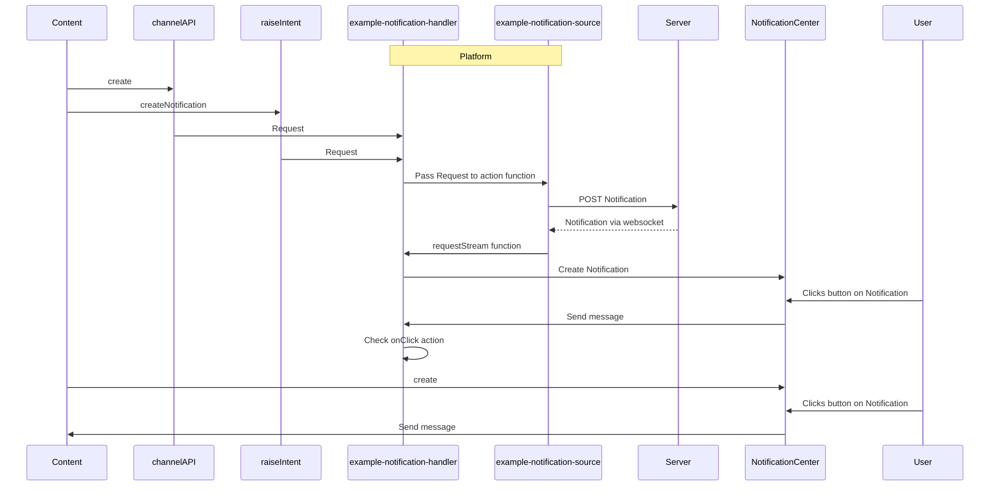

# Example Notification Handler

## What does it do?

This is an example. The goal of this module is as follows:

- Demonstrate how content can create notifications
  - notification API (this is the most powerful and flexible option for content creators)
  - ChannelAPI (you expose an SDK to your content providers)
  - Intents (allow content to trigger a notification through fdc3.raiseIntent or fin.me.interop.fireIntent)
- Let a platform listen to and support a number of specific actions from form and action submissions:
  - raise-intent - raise an intent, pass a context object and optionally target a specific app and app instance.
  - launch-app - launch an app defined in app directory
  - broadcast - broadcast a context object to an app channel or user channel
  - Add your option here. This is an example so the idea is that this should be a discussion between the platform and content developers about use cases.
- Think about server side support. The example uses an endpoint to fire actions and listen to a stream. If everything goes through the endpoint the notification could go to the server and come back through a websocket (the example endpoint does not have a server). Things to consider:
  - Do you pass all notifications and actions to the server so that they can be audited and passed to other connected machines or are some local and go straight to the stream instead of doing a round trip to the server?
  - Do you store a correlation id and send that to the server so that you know which notification actions (create, update, clear, close) you need to reflect locally.
  - How do you identify this instance (app uuid), machine and user (fin.System.getUniqueUserId) so that you can easily determine what notifications are missing.



## How is it configured?

This example module is defined as a lifecycle module in a manifest or settings service:

```json
{
  "id": "example-notification-handler",
  "icon": "http://localhost:8080/favicon.ico",
  "title": "example notification handler",
  "description": "example notification handler",
  "enabled": true,
  "url": "http://localhost:8080/js/modules/lifecycle/example-notification-handler.bundle.js",
  "data": {}
}
```

The module supports a number of options being passed to it through the data property:

```js
{
 /**
  * Notification source root endpoint id. It will use this root and append -create, -update, -clear, and -stream and use that as an endpoint. The default is notification-source as the root endpoint id.
  */
 notificationSourceRootEndpointId?: string;
 /**
  * does this handler support notification requests as an intent.
  * Default is true with CreateNotification as an intent name expecting an openfin.notification context object.
  */
 intentHandler?: {
  /**
   * Is the intent handler enabled. Default is yes so you specify this if you wish to turn it off.
   */
  enabled: boolean;
  /**
   * Do you want a custom name for the intent. Default is CreateNotification, UpdateNotification and ClearNotification.
   */
  name?: {
   create: string;
   update: string;
   clear: string;
  };
 };

 /**
  * Do you want to listen for notification requests via a channel.
  */
 channelHandler?: {
  /**
   * Is the channel handler enabled. Default is yes so you specify this if you wish to turn it off.
   */
  enabled: boolean;
  /**
   * Do you want to specify a custom channel name that gets appended to platform-uuid/ default is
   * notification-handler which will expose a create function. So the channel name is
   * platform-uuid/notification-handler.
   */
  name?: string;
 };

 /**
  * Options to support the raising of intents in response to notifications.
  */
 intentLauncher?: {
  /**
   * If an instanceId is provided and it is not found, should a new instance be created or should it fallback to an existing instance. The default is to use an existing instance.
   */
  instanceIdFallback: "existing" | "new";
 };
}
```

## What about Endpoints?

This module uses a number of endpoints that are provided by a single example endpoint module. This can be swapped out for another endpoint as long as it supports the action and requestStream methods and supports the same types.

A stripped down endpoint provider that just shows the information related to this notification source is shown below:

```json
"endpointProvider": {
   "modules": [
    {
     "id": "example-notification-source",
     "icon": "http://localhost:8080/favicon.ico",
     "title": "Example Notification Source",
     "description": "Example Notification Source",
     "enabled": true,
     "url": "http://localhost:8080/js/modules/endpoint/example-notification-source.bundle.js",
     "data": {}
    }
   ],
   "endpoints": [
    {
     "id": "notification-source-create",
     "type": "module",
     "typeId": "example-notification-source",
     "options": {}
    },
    {
     "id": "notification-source-clear",
     "type": "module",
     "typeId": "example-notification-source",
     "options": {}
    },
    {
     "id": "notification-source-close",
     "type": "module",
     "typeId": "example-notification-source",
     "options": {}
    },
    {
     "id": "notification-source-update",
     "type": "module",
     "typeId": "example-notification-source",
     "options": {}
    },
    {
     "id": "notification-source-stream",
     "type": "module",
     "typeId": "example-notification-source",
     "options": {}
    }
   ],
   "endpointClients": {
    "clientOptions": [
     {
      "enabled": true,
      "id": "example-notification-handler",
      "endpointIds": ["notification-source-create",
          "notification-source-clear",
          "notification-source-close",
          "notification-source-update",
          "notification-source-stream"]
     }
    ]
   }
  }
```

### Modules definition

The JavaScript module to load that contains all of the information needed for managing notification actions.

### Endpoint definition

Multiple entries for each of the actions we want to expose. This could have been a single entry and you could determine the request by the passed request object but we have split it into multiple endpoints so you can defined specific settings if you wanted to or if you wanted more granular permissions.

### Endpoint Clients

The platform supports an example of how you could determine which endpoints a module has access to. Here you can see that the example-notification-handler has been given access just to the endpoints it requires.

## Calling it from Content

### Notification Context Objects

Whether you are using the Channel API or raising an intent we have defined the following types of context object:

#### Create a notification context

```js
{
 "type": "openfin.notificationoptions",
 "notification": { } // This will be the NotificationOptions object used by the OpenFin Notification Library.
}
```

How to specify a notification action that triggers an intent:

```js
let raiseIntentNotification = {
  type: 'openfin.notificationoptions',
  notification: {
    id: 'guid-goes-here',
    title: 'Example Raise Intent Notification',
    body: 'Click the button to raise an intent',
    buttons: [
      {
        onClick: {
          task: 'raise-intent',
          customData: {
            context: {
              type: 'fdc3.contact',
              name: 'John Example',
              id: {
                email: 'john@example.com',
                phone: 'Number goes here'
              }
            },
            name: 'StartCall',
            target: {
              appId: 'call-app',
              instanceId: 'instanceId if available'
            }
          }
        },
        cta: true,
        title: 'Start A Call',
        type: 'button'
      }
    ]
  }
};
```

How to specify a notification that launches an app:

```js
let launchAppNotification = {
  type: 'openfin.notificationoptions',
  notification: {
    id: 'guid-goes-here',
    title: 'Example Launches App',
    body: 'Click the button to launch an app.',
    buttons: [
      {
        onClick: {
          task: 'launch-app',
          target: {
            appId: 'call-app'
          }
        },
        cta: true,
        title: 'Open Call App',
        type: 'button'
      }
    ]
  }
};
```

How to specify a notification that broadcasts a context object on an app channel:

```js
let appBroadcastNotification = {
  type: 'openfin.notificationoptions',
  notification: {
    id: 'guid-goes-here',
    title: 'Broadcast on App Channel',
    body: 'Click the button to broadcast on an app channel.',
    buttons: [
      {
        onClick: {
          task: 'broadcast',
          customData: {
            context: {
              type: 'fdc3.contact',
              name: 'John Example',
              id: {
                email: 'john@example.com',
                phone: 'Number goes here'
              }
            },
            name: 'custom-app-channel'
          }
        },
        cta: true,
        title: 'Broadcast On App Channel',
        type: 'button'
      }
    ]
  }
};
```

How to specify a notification that broadcasts a context object on a user channel:

```js
let userBroadcastNotification = {
  type: 'openfin.notificationoptions',
  notification: {
    id: 'guid-goes-here',
    title: 'Broadcast on User Channel',
    body: 'Click the button to broadcast on a user channel.',
    buttons: [
      {
        onClick: {
          task: 'broadcast',
          customData: {
            context: {
              type: 'fdc3.contact',
              name: 'John Example',
              id: {
                email: 'john@example.com',
                phone: 'Number goes here'
              }
            },
            name: 'green',
            broadcastOptions: {
              isUserChannel: true
            }
          }
        },
        cta: true,
        title: 'Broadcast On User Channel',
        type: 'button'
      }
    ]
  }
};
```

How to specify a notification that updates an existing notification:

#### Update a notification context

```js
{
 "type": "openfin.updatablenotificationoptions",
 "notification": {
    "id": "guid-goes-here",
    "body": "notification has been updated and buttons have been removed.",
    "template": "markdown"
 }
}
```

#### Clear a notification context

```js
let clearNotification = {
  type: 'openfin.notification',
  notification: {
    id: 'guid-goes-here'
  }
};
```

### Use Channel API

```js
const client = await fin.InterApplicationBus.Channel.connect(`${fin.me.identity.uuid}/notification-handler`);
await client.dispatch('create', {
  type: 'openfin.notificationoptions',
  notification: {
    id: 'guid-goes-here',
    title: 'Example Launches App',
    body: 'Click the button to launch an app.',
    buttons: [
      {
        onClick: {
          task: 'launch-app',
          target: {
            appId: 'call-app'
          }
        },
        cta: true,
        title: 'Open Call App',
        type: 'button'
      }
    ]
  }
});

// other dispatch commands:
// - 'update' passing it the notification update context
// - 'clear' passing it the notification context with the id of the notification you want to clear
```

### Use FDC3 Intent API

```js
await fdc3.raiseIntent('CreateNotification', {
  type: 'openfin.notificationoptions',
  notification: {
    id: 'guid-goes-here',
    title: 'Example Launches App',
    body: 'Click the button to launch an app.',
    buttons: [
      {
        onClick: {
          task: 'launch-app',
          target: {
            appId: 'call-app'
          }
        },
        cta: true,
        title: 'Open Call App',
        type: 'button'
      }
    ]
  }
});

// other intents:
// - 'UpdateNotification' passing it the notification update context
// - 'ClearNotification' passing it the notification context with the id of the notification you want to clear
```

### Use Interop API

```js
await fin.me.interop.fireIntent({
  name: 'CreateNotification',
  context: {
    type: 'openfin.notificationoptions',
    notification: {
      id: 'guid-goes-here',
      title: 'Example Launches App',
      body: 'Click the button to launch an app.',
      buttons: [
        {
          onClick: {
            task: 'launch-app',
            target: {
              appId: 'call-app'
            }
          },
          cta: true,
          title: 'Open Call App',
          type: 'button'
        }
      ]
    }
  }
});

// other intents:
// - 'UpdateNotification' passing it the notification update context
// - 'ClearNotification' passing it the notification context with the id of the notification you want to clear
```

## Declaring Platform Support for Intents

The lifecycle module in this example registers intent handlers if it is enabled through config (by default it is).

The platform needs to indicate that it supports these intents so that the interop broker knows where to direct the intent request.

Some options are available:

- interop broker overrides - You could create an override that looks for specific intents and handles the logic directly.
- app definition - instead of treating your platform different when it comes to the discovery and resolving of intents you could simply add an entry for your platform that declares the intents it supports.

In our example we have gone for the second option to have the same rules apply when resolving an intent. Our app definition has a few settings that mean it isn't meant to be launched:

- It is marked as private so it doesn't show up in home or any other UI
- It has an instance mode of single so that we won't try to launch more than one
- We declare it as type of window and the appId reflects the platform uuid (the provider.html always has the uuid and name as the same thing). The interop broker would not launch a new instance as the provider already has an existing window.

This was added through the platform-apps.json file in the public folder.

```json
{
  "appId": "workspace-platform-starter",
  "name": "workspace-platform-starter",
  "title": "Workspace Platform Starter Platform",
  "description": "The platform that is currently running.",
  "manifest": {
    "url": "http://localhost:8080/platform/provider.html"
  },
  "manifestType": "inline-window",
  "icons": [
    {
      "src": "http://localhost:8080/common/images/icon-blue.png"
    }
  ],
  "instanceMode": "single",
  "private": true,
  "contactEmail": "contact@example.com",
  "supportEmail": "support@example.com",
  "publisher": "OpenFin",
  "intents": [
    {
      "name": "CreateNotification",
      "displayName": "Create Notification",
      "contexts": ["openfin.notificationoptions"]
    },
    {
      "name": "UpdateNotification",
      "displayName": "Update Notification",
      "contexts": ["openfin.updatablenotificationoptions"]
    },
    {
      "name": "ClearNotification",
      "displayName": "Clear Notification",
      "contexts": ["openfin.notification"]
    }
  ],
  "images": [],
  "tags": ["platform"]
}
```
