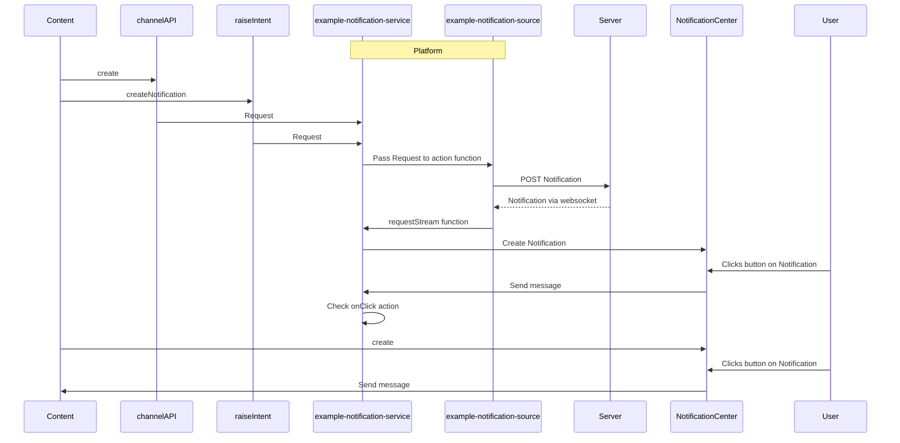

# Example Notification Service

## What does it do?

This is an example. The goal of this module is as follows:

- Demonstrate how content can create notifications
  - notification API (this is the most powerful and flexible option for content creators)
  - ChannelAPI (you expose an SDK to your content providers)
  - Intents (allow content to trigger a notification through fdc3.raiseIntent or fin.me.interop.fireIntent) - this lets the platform decide the most appropriate way of showing a notification and the platform supports a set number of actions that content developers do not need to worry about.
- Let a platform listen to and support a number of specific actions from form and action submissions:
  - raise-intent - raise an intent, pass a context object and optionally target a specific app and app instance. This might be one app triggering a notification that raises an intent for another app (e.g ViewChart) or it may trigger a notification and target itself through an Intent and specifying it's app id and instance id (e.g. HandleNotificationResponse).
  - launch-app - launch an app defined in app directory
  - broadcast - broadcast a context object to an app channel or user channel
  - endpoint - lookup the specified endpoint id (you must permission this module to have access to the specified endpoint id) and call an action passing in a context or request object as the request
  - launch-content - launches the page with the provided page id or focuses on that page if it is already open.
  - Add your option here. This is an example so the idea is that this should be a discussion between the platform and content developers about use cases.
- Think about server side support. The example uses an endpoint to fire actions and listen to a stream. If everything goes through the endpoint the notification could go to the server and come back through a websocket (the workspace platform starter server does not include websocket support to simplify things but we do have a node-starter example that can be used with this example. See [node-starter/how-to/setup-an-example-websocket-server](https://github.com/built-on-openfin/node-starter/tree/main/how-to/setup-an-example-websocket-server)). Things to consider:
  - Do you pass all notifications and actions to the server so that they can be audited and passed to other connected machines or are some local and go straight to the stream instead of doing a round trip to the server?
  - Do you store a correlation id and send that to the server so that you know which notification actions (create, update, clear, close) you need to reflect locally.
  - How do you identify this instance (app uuid), machine and user (fin.System.getUniqueUserId) so that you can easily determine what notifications are missing.
- Think about additional security
  - Do you wish to restrict the applications that can raise the intent to ones that declare that they raise it through the interop section of an app catalog entry (or some other means)
  - If they request to broadcast a context object when they raise the request do you check the interop config of the app to see if they declare that they broadcast that type of object
  - Do you wish to allow every app to launch any other app or should there be restrictions?
  - For endpoints, we restrict the access this example module has to endpoints so that you have to declare them but should the originator (if not the server) be validated as well.



## How is it configured?

This example module is defined as a lifecycle module in a manifest or settings service:

```json
{
  "id": "example-notification-service",
  "icon": "http://localhost:8080/favicon.ico",
  "title": "example notification service",
  "description": "example notification service",
  "enabled": true,
  "url": "http://localhost:8080/js/modules/lifecycle/example-notification-service.bundle.js",
  "data": {}
}
```

The module supports a number of options being passed to it through the data property:

```js
{
 /**
  * Notification source root endpoint id. It will use this root and append -create, -update, -clear, and -stream and use that as an endpoint. The default is notification-source as the root endpoint id.
  */
 notificationSourceRootEndpointId?: string;
 /**
  * does this service support notification requests as an intent.
  * Default is true with CreateNotification as an intent name expecting an openfin.notification context object.
  */
 intentHandler?: {
  /**
   * Is the intent service enabled. Default is yes so you specify this if you wish to turn it off.
   */
  enabled: boolean;
  /**
   * Do you want a custom name for the intent. Default is CreateNotification, UpdateNotification and ClearNotification.
   */
  name?: {
   create: string;
   update: string;
   clear: string;
  };
 };

 /**
  * Do you want to listen for notification requests via a channel.
  */
 channelHandler?: {
  /**
   * Is the channel service enabled. Default is yes so you specify this if you wish to turn it off.
   */
  enabled: boolean;
  /**
   * Do you want to specify a custom channel name that gets appended to platform-uuid/ default is
   * notification-service which will expose a create function. So the channel name is
   * platform-uuid/notification-service.
   */
  name?: string;
 };

 /**
  * Options to support the raising of intents in response to notifications.
  */
 intentLauncher?: {
  /**
   * If an instanceId is provided and it is not found, should a new instance be created or should it fallback to an existing instance. The default is to use an existing instance.
   */
  instanceIdFallback: "existing" | "new";
 };
}
```

## What about Endpoints?

We have an example endpoint example-notification-source module that provides an API that can be called by this module. It is an example module with the option of adding notifications requested onto the stream of notifications (so this module will process it) as well as a simulated dynamic source of notifications (platform lifecycle events).

Please see the [example-notification-source](../../endpoint/example-notification-source/README.md) readme for more information.

## Calling it from Content

### Notification Context Objects

#### Endpoint Notification Source Format

The data coming from the endpoint that represents a notification event source should match the following (the notification option and updatable options should include the format of notifications shown below if you want the buttons to trigger supported functions).

Create a notification:

```js
{
 "eventId": "create",
 "payload": { } // This will be the NotificationOptions object used by the OpenFin Notification Library.
}
```

Update a notification:

```js
{
 "eventId": "update",
 "payload": { } // This will be the UpdatableNotificationOptions object used by the OpenFin Notification Library.
}
```

Clear a notification:

```js
{
 "eventId": "clear",
 "payload": { "id": "Id of the notification to clear"}
}
```

Notify that a notification has been closed so that you can clear a local notification:

```js
{
 "eventId": "close",
 "payload": { "id": "Id of the notification to clear"}
}
```

#### Client Side Creation

Whether you are using the Channel API or raising an intent we have defined the following types of context object:

#### Create a notification context

```js
{
 "type": "openfin.notificationoptions",
 "notification": { } // This will be the NotificationOptions object used by the OpenFin Notification Library.
}
```

> **_:information_source: Notification Object:_** The notification object shown in the examples below is a standard notification object. What we enforce through the example is that the notification have an onClick setting that specifies **task** and lists one of our supported tasks and **customData** that reflects the data required by the custom task. **id** plays an important role as it specifies either the intent you wish to fire, the app you wish to launch, the id of the content you wish to launch, the endpoint you wish to target, the user context group you wish to target or the custom app channel you wish to target.

How to specify a notification action that triggers an intent:

```js
let raiseIntentNotification = {
  type: 'openfin.notificationoptions',
  notification: {
    id: 'guid-goes-here',
    title: 'Example Raise Intent Notification',
    body: 'Click the button to raise an intent',
    buttons: [
      {
        onClick: {
          task: 'raise-intent',
          customData: {
            id: 'StartCall',
            context: {
              type: 'fdc3.contact',
              name: 'John Example',
              id: {
                email: 'john@example.com',
                phone: 'Number goes here'
              }
            },
            target: {
              appId: 'call-app',
              instanceId: 'instanceId if available'
            }
          }
        },
        cta: true,
        title: 'Start A Call',
        type: 'button'
      }
    ]
  }
};
```

How to specify a notification that launches an app:

```js
let launchAppNotification = {
  type: 'openfin.notificationoptions',
  notification: {
    id: 'guid-goes-here',
    title: 'Example Launches App',
    body: 'Click the button to launch an app.',
    buttons: [
      {
        onClick: {
          task: 'launch-app',
          customData: {
            id: 'call-app'
          }
        },
        cta: true,
        title: 'Open Call App',
        type: 'button'
      }
    ]
  }
};
```

How to specify a notification that launches an app, targets a specific instance (e.g. itself) and passes context to the apps context handler (so you don't need an intent to be registered to get some data back):

```js
let launchAppNotification = {
  type: 'openfin.notificationoptions',
  notification: {
    id: 'guid-goes-here',
    title: 'Example Launches App',
    body: 'Click the button to launch an app.',
    buttons: [
      {
        onClick: {
          task: 'launch-app',
          customData: {
            id: 'call-app',
            context: {
              type: 'fdc3.contact',
              name: 'John Example',
              id: {
                email: 'john@example.com',
                phone: 'Number goes here'
              }
            },
            target: {
              appId: 'call-app',
              instanceId: 'instanceId if available'
            }
          }
        },
        cta: true,
        title: 'Open Call App',
        type: 'button'
      }
    ]
  }
};
```

How to specify a notification that launches saved content i.e. a page:

```js
let launchContentNotification = {
  type: 'openfin.notificationoptions',
  notification: {
    id: 'guid-goes-here',
    title: 'Example Launches Page',
    body: 'Click the button to launch or focus on a specific page.',
    buttons: [
      {
        onClick: {
          task: 'launch-content',
          customData: {
            id: 'page-id'
          }
        },
        cta: true,
        title: 'Open Call App',
        type: 'button'
      }
    ]
  }
};
```

How to specify a notification that broadcasts a context object on an app channel:

```js
let appBroadcastNotification = {
  type: 'openfin.notificationoptions',
  notification: {
    id: 'guid-goes-here',
    title: 'Broadcast on App Channel',
    body: 'Click the button to broadcast on an app channel.',
    buttons: [
      {
        onClick: {
          task: 'broadcast',
          customData: {
            id: 'custom-app-channel',
            context: {
              type: 'fdc3.contact',
              name: 'John Example',
              id: {
                email: 'john@example.com',
                phone: 'Number goes here'
              }
            }
          }
        },
        cta: true,
        title: 'Broadcast On App Channel',
        type: 'button'
      }
    ]
  }
};
```

How to specify a notification that broadcasts a context object on a user channel:

```js
let userBroadcastNotification = {
  type: 'openfin.notificationoptions',
  notification: {
    id: 'guid-goes-here',
    title: 'Broadcast on User Channel',
    body: 'Click the button to broadcast on a user channel.',
    buttons: [
      {
        onClick: {
          task: 'broadcast',
          customData: {
            id: 'green',
            context: {
              type: 'fdc3.contact',
              name: 'John Example',
              id: {
                email: 'john@example.com',
                phone: 'Number goes here'
              }
            },
            broadcastOptions: {
              isUserChannel: true
            }
          }
        },
        cta: true,
        title: 'Broadcast On User Channel',
        type: 'button'
      }
    ]
  }
};
```

How to specify a form notification that broadcasts a context object on a user channel:

```js
let userBroadcastFormNotification = {
  type: 'openfin.notificationoptions',
  notification: {
    id: 'guid-goes-here',
    title: 'Broadcast Form on User Channel',
    body: 'Click the button to broadcast on a user channel.',
    form: [
      {
        type: 'boolean',
        key: 'intendedThemeChange',
        label: 'Did you intend to change the theme?',
        widget: {
          type: 'Toggle'
        }
      }
    ],
    buttons: [
      {
        onClick: {
          task: 'broadcast',
          customData: {
            id: 'green',
            context: {
              type: 'custom.context',
              name: 'Form Submitted'
            },
            broadcastOptions: {
              isUserChannel: true
            }
          }
        },
        cta: true,
        submit: true,
        title: 'Broadcast On Green',
        type: 'button'
      }
    ]
  }
};
```

How to specify a notification that sends a request to an endpoint action (so it could be passed onto a backend). The notification service needs to be listed in the endpointClients clientOptions list:

```js
let endpointtNotification = {
  type: 'openfin.notificationoptions',
  notification: {
    id: 'guid-goes-here',
    title: 'Trigger a post to a backend through a CTA',
    body: 'Click the button to call an action on the specified endpoint.',
    buttons: [
      {
        onClick: {
          task: 'endpoint',
          customData: {
            id: 'endpointId you wish to call. The notification service module must be permitted to access this endpoint through endpointClients',
            context: {
              type: 'fdc3.contact',
              name: 'John Example',
              id: {
                email: 'john@example.com',
                phone: 'Number goes here'
              }
            },
            endpointOptions: {
              request: {
                description:
                  'If request is specified then context will be ignored and this object will be sent to the endpoint as the request'
              }
            }
          }
        },
        cta: true,
        title: 'Send to Endpoint',
        type: 'button'
      }
    ]
  }
};
```

How to specify a notification that updates an existing notification:

#### Update a notification context

```js
{
 "type": "openfin.updatablenotificationoptions",
 "notification": {
    "id": "guid-goes-here",
    "body": "notification has been updated and buttons have been removed.",
    "template": "markdown"
 }
}
```

#### Clear a notification context

```js
let clearNotification = {
  type: 'openfin.notification',
  notification: {
    id: 'guid-goes-here'
  }
};
```

### Use Channel API

```js
const client = await fin.InterApplicationBus.Channel.connect(`${fin.me.identity.uuid}/notification-service`);
await client.dispatch('create', {
  type: 'openfin.notificationoptions',
  notification: {
    id: 'guid-goes-here',
    title: 'Example Launches App',
    body: 'Click the button to launch an app.',
    buttons: [
      {
        onClick: {
          task: 'launch-app',
          customData: {
            id: 'call-app'
          }
        },
        cta: true,
        title: 'Open Call App',
        type: 'button'
      }
    ]
  }
});

// other dispatch commands:
// - 'update' passing it the notification update context
// - 'clear' passing it the notification context with the id of the notification you want to clear
```

### Use FDC3 Intent API

```js
await fdc3.raiseIntent('CreateNotification', {
  type: 'openfin.notificationoptions',
  notification: {
    id: 'guid-goes-here',
    title: 'Example Launches App',
    body: 'Click the button to launch an app.',
    buttons: [
      {
        onClick: {
          task: 'launch-app',
          customData: {
            id: 'call-app'
          }
        },
        cta: true,
        title: 'Open Call App',
        type: 'button'
      }
    ]
  }
});

// other intents:
// - 'UpdateNotification' passing it the notification update context
// - 'ClearNotification' passing it the notification context with the id of the notification you want to clear
```

### Use Interop API

```js
await fin.me.interop.fireIntent({
  name: 'CreateNotification',
  context: {
    type: 'openfin.notificationoptions',
    notification: {
      id: 'guid-goes-here',
      title: 'Example Launches App',
      body: 'Click the button to launch an app.',
      buttons: [
        {
          onClick: {
            task: 'launch-app',
            customData: {
              id: 'call-app'
            }
          },
          cta: true,
          title: 'Open Call App',
          type: 'button'
        }
      ]
    }
  }
});

// other intents:
// - 'UpdateNotification' passing it the notification update context
// - 'ClearNotification' passing it the notification context with the id of the notification you want to clear
```

## Declaring Platform Support for Intents

The lifecycle module in this example registers intent handlers if it is enabled through config (by default it is).

The platform needs to indicate that it supports these intents so that the interop broker knows where to direct the intent request.

Some options are available:

- interop broker overrides - You could create an override that looks for specific intents and handles the logic directly.
- app definition - instead of treating your platform different when it comes to the discovery and resolving of intents you could simply add an entry for your platform that declares the intents it supports.

In our example we have gone for the second option to have the same rules apply when resolving an intent. Our app definition has a few settings that mean it isn't meant to be launched:

- It is marked as private so it doesn't show up in home or any other UI
- It has an instance mode of single so that we won't try to launch more than one
- We declare it as type of window and the appId reflects the platform uuid (the provider.html always has the uuid and name as the same thing). The interop broker would not launch a new instance as the provider already has an existing window.

This was added through the platform-apps.json file in the public folder.

```json
{
  "appId": "workspace-platform-starter",
  "name": "workspace-platform-starter",
  "title": "Workspace Platform Starter Platform",
  "description": "The platform that is currently running.",
  "manifest": {
    "url": "http://localhost:8080/platform/provider.html"
  },
  "manifestType": "inline-window",
  "icons": [
    {
      "src": "http://localhost:8080/common/images/icon-blue.png"
    }
  ],
  "instanceMode": "single",
  "private": true,
  "contactEmail": "contact@example.com",
  "supportEmail": "support@example.com",
  "publisher": "OpenFin",
  "intents": [
    {
      "name": "CreateNotification",
      "displayName": "Create Notification",
      "contexts": ["openfin.notificationoptions"]
    },
    {
      "name": "UpdateNotification",
      "displayName": "Update Notification",
      "contexts": ["openfin.updatablenotificationoptions"]
    },
    {
      "name": "ClearNotification",
      "displayName": "Clear Notification",
      "contexts": ["openfin.notification"]
    }
  ],
  "images": [],
  "tags": ["platform"]
}
```
