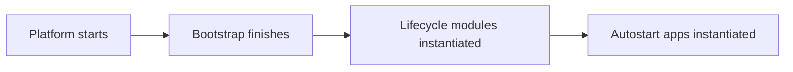

> **_:information_source: OpenFin Workspace:_** [OpenFin Workspace](https://www.openfin.co/workspace/) is a commercial product and this repo is for evaluation purposes (See [LICENSE.MD](../LICENSE.MD)). Use of the OpenFin Container and OpenFin Workspace components is only granted pursuant to a license from OpenFin (see [manifest](../public/manifest.fin.json)). Please [**contact us**](https://www.openfin.co/workspace/poc/) if you would like to request a developer evaluation key or to discuss a production license.

[<- Back to Table Of Contents](../README.md)

# How To Add A Service

First a definition of what we mean by service:

> A service is something that is not visible, automatically starts up when the platform starts, runs until the platform closes and executes some custom code created by a developer.

There are two approaches to achieving the following:

- Create a lifecycle module (see [how to use lifecycle events](./how-to-use-lifecycle-events.md))
- Create a headless app and add it to your app directory configured to autostart (see [how to add an app](./how-to-define-apps.md))

This document will describe the two options in more detail and the reasons why you might pick one over the other.

## Lifecycle Module

A lifecycle module is a JavaScript module that is built (see [how to use lifecycle events](./how-to-use-lifecycle-events.md)) by a platform developer or a content developer. A platform owner can then register the module through configuration so that it loads up and is executed at the specified lifecycle event (e.g. after bootstrapping).

### Benefits of a lifecycle module

- You don't require a html page and you just need to host a JavaScript file
- Modules have access to platform helper methods and might therefore be the right choice depending on what you want to do (e.g. if you want to create a notification service the platform can permission a module so that it can request a notification client)
- You only need module configuration, you don't need to define an application

## Headless Application

You can register an application in the app directory (see [how to add an app](./how-to-define-apps.md)) and you can specify the following:

- It is of type: window (manifestType: window or inline-window)
- It is a singleton so only a single instance is fired up (instanceMode: single)
- It starts up automatically when the platform starts (autostart: true)
- It is private and does not show up in Home, Store or Dock (private: true)

As part of the window definition you will want to set the following settings in the window manifest file or inline settings:

- includeInSnapshots: false (you do not want this background window to be included and switched out when workspaces are applied)
- autoShow: false (you do not want this window to be visible)

### Benefits of a headless application

- It makes for a good intent target (you can specify the intents you support in the app definition)
- It lets you load up a url that is part of the content provider's domain (if the platform provider and content provider are hosted in different domains)
- It's simpler (you can start off with a basic web page that console logs hello world and start from there)
- You can use the fdc3 api (modules have a getInteropClient helper function which can still share context and raise intents but the fdc3 api is not available)

## Platform Startup flow

## Which one should I use?

A lot of it is down to what your requirements are but here are two main use cases and our suggestion:

If you are looking at building something that will handle intents -> Use a headless application as a service.

If you are looking at listening to notifications from a backend and push out notifications -> Use a lifecycle module that is fired after the bootstrap process and use the getNotificationClient helper method.

## Source Reference

- [Example hidden window definition: hidden.window.fin.json](../public/common/windows/hidden-window/hidden.window.fin.json)
- [Example notification service using a lifecycle module: lifecycle.ts](../client/src/modules/lifecycle/example-notification-service/lifecycle.ts)

[<- Back to Table Of Contents](../README.md)
