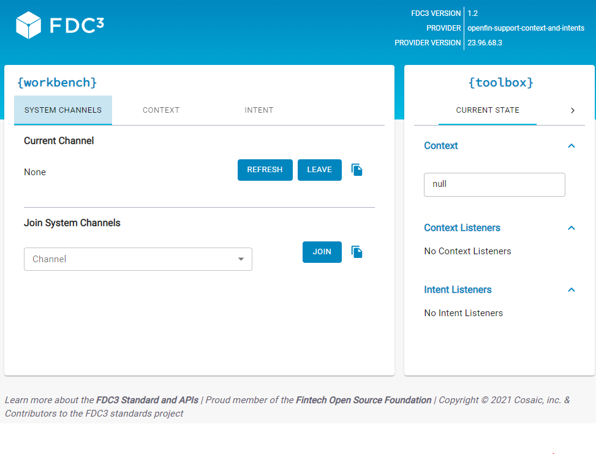

> **_:information_source: OpenFin Workspace:_** [OpenFin Workspace](https://www.openfin.co/workspace/) is a commercial product and this repo is for evaluation purposes (See [LICENSE.MD](../LICENSE.MD)). Use of the OpenFin Container and OpenFin Workspace components is only granted pursuant to a license from OpenFin (see [manifest](../public/manifest.fin.json)). Please [**contact us**](https://www.openfin.co/workspace/poc/) if you would like to request a developer evaluation key or to discuss a production license.
> OpenFin Workspace is currently **only supported on Windows** although you can run the sample on a Mac for development purposes.

[<- Back to Table Of Contents](../README.md)

# How To Add Context Support To Your App

If you have added a view (url based app) to an app directory/source (see [How To Define Apps](./how-to-define-apps.md)) you may want it to be able to share data with one or more apps within your platform.

The first thing your app should do is to highlight that it supports the FDC3 standard by opting into the api through it's settings (this can either be inline e.g. manifestType inline-view or a json file manifestType: view). E.g.:

```json
{
    "url": "https://fdc3.finos.org/toolbox/fdc3-workbench/",
    "fdc3InteropApi": "1.2"
},
```

A workspace platform can define a set of contextual groups (system channels). You can default to unassigned and let the end user assign your app to a group or you can default yourself to one of them:

```json
{
    "url": "https://fdc3.finos.org/toolbox/fdc3-workbench/",
    "fdc3InteropApi": "1.2",
    "interop": {
        "currentContextGroup": "green"
    }
},
```

## Do I Need To Reference An Npm Module

You don't need to reference an npm module for the API as we inject the API into your document. If you want to access the TypeScript types then you can reference the official FinOS types package: [FDC3 Types NPM Package](https://www.npmjs.com/package/@finos/fdc3/v/1.2.0)

## How Do I Listen For Contextual Messages?

In your app would check for the fdc3 api and then register a contextual listener:

## How Do I Listen For All Contextual Messages On A System Channel?

```javascript
// --------------------------------
// Listening code
// --------------------------------
if (window.fdc3 !== undefined) {
  const systemHandler = (ctx) => {
    console.log('System Context Received: ', ctx);
  };
  const systemListener = fdc3.addContextListener(null, systemHandler);
}
```

## How Do I Listen For Specific Contextual Messages On A System Channel?

```javascript
// --------------------------------
// Listening code
// --------------------------------
if (window.fdc3 !== undefined) {
  const contactHandler = (contact) => {
    console.log('Contact Context Received: ', contact);
  };
  const systemListener = fdc3.addContextListener('fdc3.contact', contactHandler);
}
```

## How Do I Send Out Contextual Messages On A System Channel?

In your app your would check for the fdc3 api and then use the broadcast function:

```javascript
// --------------------------------
// Broadcasting code
// --------------------------------
if (window.fdc3 !== undefined) {
  const context = {
    type: 'fdc3.contact',
    name: 'John McHugh',
    id: {
      email: 'john.mchugh@example.com'
    }
  };

  const systemChannel = await fdc3.getCurrentChannel();

  if (systemChannel !== null) {
    console.log('broadcasting on ' + systemChannel.type + ' channel: ' + systemChannel.id, context);
    fdc3.broadcast(context);
  } else {
    console.log('You are not bound to a system channel');
  }
}
```

## How Do I Listen For Contextual Messages On App Specific Channels?

Why use App Channels? Lets say you want to share specific contextual objects between views/apps you control or you want to ensure that your applications are listening regardless of user selection.

```javascript
// --------------------------------
// Listening code
// --------------------------------
if (window.fdc3 !== undefined) {
  const appHandler = (ctx) => {
    console.log('App Channel Context Received: ', ctx);
  };

  const channel = 'custom-app-channel';
  const appChannel = await fdc3.getOrCreateChannel(channel);
  const appListener = appChannel.addContextListener(null, appHandler);
}
```

As you can see it is very similar with the one difference being you create a specific channel rather than using one you are bound to.

## How Do I Send Out Contextual Messages To A Specific App Channel?

```javascript
// --------------------------------
// Broadcasting code
// --------------------------------
if (window.fdc3 !== undefined) {
  const context = {
    type: 'fdc3.contact',
    name: 'John McHugh',
    id: {
      email: 'john.mchugh@example.com'
    }
  };

  const channel = 'custom-app-channel';

  const appChannel = await fdc3.getOrCreateChannel(channel);

  console.log('broadcasting on ' + appChannel.type + ' channel: ' + appChannel.id, context);

  appChannel.broadcast(context);
}
```

As you can see it is very similar to the system channel approach with the one difference being you create a specific channel to broadcast against instead of using the one you are bound to.

## Context Objects

You can see a list of FDC3 Context Object Definitions here: [FDC3 Context](https://fdc3.finos.org/docs/context/ref/Context).

## Custom Context Objects

If the types listed do not fit your needs the spec was built with extension in mind. You can create your own object types. Remember that you have to specify a type property and the suggestion is to use your organization as part of the namespace in order to avoid conflicts. E.g.

```json
{
  "type": "org.dayofinterest",
  "id": {
    "date": "2024/12/24"
  }
}
```

## What if I have content from multiple content providers and some of them need different ids?

As a platform you can take advantage of having your own interop broker. You can override a function and enrich a context object before it is passed onto all subscribers.

```javascript
/**
   * Sets a context for the context group of the incoming current entity.
   * @param { SetContextOptions } setContextOptions - New context to set.
   * @param { ClientIdentity } clientIdentity - Identity of the client sender.
   * @return { void }
   */
  public async setContext(
   sentContext: { context: OpenFin.Context },
   clientIdentity: OpenFin.ClientIdentity
  ): Promise<void> {
   // enrich context object here if pieces of data are missing
   super.setContext(sentContext, clientIdentity);
  }
```

If you are a platform owner with a variable number of apps from different content providers then you can come up with a pattern where you can dynamically add logic for specific types of context object that could be owned by yourself or one of the teams within your organization.

We have an example of what this could be like in workspace platform starter. You can define endpoints ([See how to define endpoints](./how-to-define-endpoints.md)) that support a requestResponse function where the context will be passed to the function, enriched and then returned. This could be a single JavaScript module for one or more context types or you might have teams that build and own their own JavaScript module for their specific context types. This will let your platform scale without requiring direct changes to your broker's setContext function.

## Test Harnesses

It is useful to be able to test your app against something. When you reference the common apps feed in your instance of workspace platform starter you get a number of useful utilities. We provide two entries related to context sharing in FDC3:

### Context Using FDC3

This app supports FDC3 System and App Channels, lists all the supported context types and generates a code preview for you to copy or simply test against. We provide a similar tool for our Interop API which is compatible with the FDC3 API as well:


### FDC3 Workbench

This is the FinOS test harness to show our compatibility:



## More Resources

- Please use our OpenFin Website for more information related to FDC3 and interop: [OpenFin FDC3 support](https://developers.openfin.co/of-docs/docs/fdc3-support-in-openfin)

[<- Back to Table Of Contents](../README.md)
