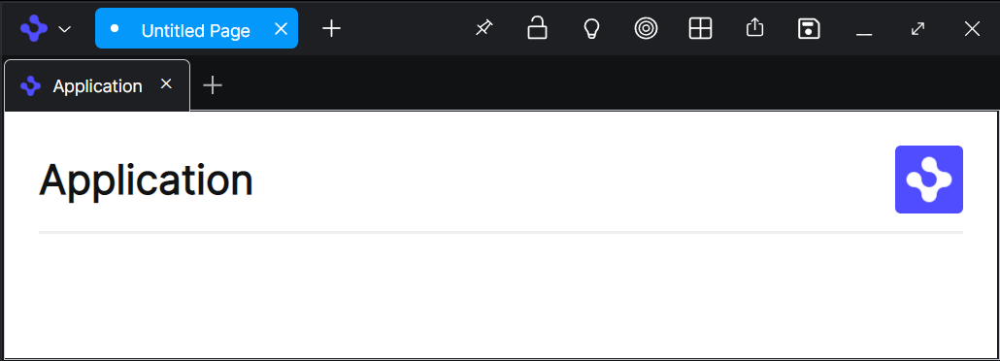

> **_:information_source: OpenFin Workspace:_** [OpenFin Workspace](https://www.openfin.co/workspace/) is a commercial product and this repo is for evaluation purposes (See [LICENSE.MD](../LICENSE.MD)). Use of the OpenFin Container and OpenFin Workspace components is only granted pursuant to a license from OpenFin (see [manifest](../public/manifest.fin.json)). Please [**contact us**](https://www.openfin.co/workspace/poc/) if you would like to request a developer evaluation key or to discuss a production license.

[<- Back to Table Of Contents](../README.md)

# How To Customize Browser

The browser is the component of OF Workspace that displays your views, see [Browser Overview](https://developers.openfin.co/of-docs/docs/browser-sdk-overview) in the main developer docs for more details.



## Customizing The Browser

In the customize example you can configure some features of the window, as well as the toolbar buttons and the menus.

To configure the `title` and `icon` for the window add the following:

### V12 and Below

```json
"browserProvider": {
    "windowOptions": {
        "title": "My Application",
        "icon": "http://localhost:8080/favicon.ico"
    }
}
```

### V12.6 and Above

```json
"browserProvider": {
    "defaultWindowOptions": {
        "icon": "http://localhost:8080/favicon.ico",
        "workspacePlatform": {
            "title": "My Application"
        }
    }
}
```

In the title bar of the window the pages are listed, by default the plus button next to the pages is not visible, this can be configured to open a view by setting `newPageUrl`. The same is true of the views, the plus button next to the view tabs is hidden by default, but can be configured by setting `newTabUrl` to open a view.

### V12 and Below For Urls

```json
"browserProvider": {
    "windowOptions": {
        ...
        "newPageUrl": "http://localhost:8080/common/views/platform/new-page.html",
        "newTabUrl": "http://localhost:8080/common/views/platform/new-tab.html"
    }
}
```

### V12.6 and Above For Urls

```json
"browserProvider": {
    "defaultWindowOptions": {
        "workspacePlatform": {
        ...
        "newPageUrl": "http://localhost:8080/common/views/platform/new-page.html",
        "newTabUrl": "http://localhost:8080/common/views/platform/new-tab.html"
        }
    }
}
```

The theming for the browser window is configured in the platform using a pallette, see [How To Theme Your Platform](./how-to-theme-your-platform.md).

## defaultWindowOptions

We have extended the browser provider to support the same defaultWindowOptions as the workspace platform. This provides more flexibility when configuring your platform without having to rely on manifest based defaultWindowOptions.

## defaultPageOptions

We now support adding defaultPageOptions to the browserProvider like you would if you were putting it in code.

```json
"browserProvider": {
    "defaultPageOptions": {
        ...
    }
}
```

## defaultViewOptions

We now support adding defaultViewOptions to the browserProvider like you would if you were putting it in code.

```json
"browserProvider": {
    "defaultViewOptions": {
        ...
    }
}
```

## Menu And Buttons

In addition to the window itself the menus and buttons can be customized, see [How To Customize Browser Buttons](./how-to-customize-browser-buttons.md) and see [How To Customize Browser Menus](./how-to-customize-browser-menus.md).

## Window Positioning Strategy

We provide window positioning strategy so launched windows are offset from each other. The windowPositioningStrategy setting lets you configure specific settings although we have provided some sensible defaults so it works without change. The is an option to disable window positioning strategy as well should you wish to turn it off (e.g. during UI automation tests where positioning isn't important).

## Unsaved Page Prompt Strategy

By default the platform will prompt you any time you try to close a page or a window containing one or more pages that have unsaved changes. In the browser provider you can specify one of three options:

- "default" - the same as leaving it empty. Always prompt.
- "skip-untitled"- if a page has the default untitled label then do not prompt to save. Only prompt to save if a page has been given a name.
- "never"- never prompt the user. If a user wishes to save they will do so before closing the window/page.

## Source Reference

- [browser.ts](../client/src/framework/platform/browser.ts)

[<- Back to Table Of Contents](../README.md)
