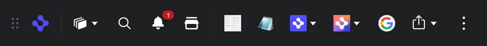

> **_:information_source: HERE Core UI:_** [HERE Core UI](https://resources.here.io/docs/core/hc-ui/) is a commercial product and this repo is for evaluation purposes (See [LICENSE.MD](../LICENSE.MD)). Use of the HERE Core Container and HERE Core UI components is only granted pursuant to a license from HERE (see [manifest](../public/manifest.fin.json)). Please [**contact us**](https://www.here.io/contact) if you would like to request a developer evaluation key or to discuss a production license.

[<- Back to Table Of Contents](../README.md)

# How To Customize Dock ?

The dock component is one of the standard components of HERE workspace, for an in depth look at the component see [Dock Overview](https://developers.openfin.co/of-docs/docs/dock-overview).



The code for the dock can be found in [dock.ts](../client/src/framework/workspace/dock.ts), `register` is called as part of the app bootstrap process and `deregister` during the app closedown. The `show` and `minimize` methods as you would expect change the visibility of the dock on the desktop.

## Enabling The Dock

To enable the dock component the following settings in the manifest must be set.

```json
"bootstrap": {
    "dock": true
}
```

You can also add `dock` to `bootstrap:autoShow` to make the dock appear when the app launches.

For more details on the bootstrapping process see [How To Customize The Bootstrapping Process](./how-to-customize-the-bootstrapping-process.md)

## Configuring The Dock

All of the dock specific configuration options are stored in `dockProvider`

As with the other HERE Core UI Components you can set the `id`, `title` and `icon` used when the platform launches the dock e.g.

```json
"dockProvider": {
    "id": "workspace-platform-starter",
    "title": "HERE Core UI Platform Starter",
    "icon": "http://localhost:8080/favicon.ico"
}
```

The dock component has some built in buttons for `Home`, `Workspaces`, `Notification Center` and `Storefront`, they can be shown/hidden with the following options.

```json
"dockProvider": {
    "workspaceComponents": {
        "hideHomeButton": false,
        "hideWorkspacesButton": false,
        "hideNotificationsButton": false,
        "hideStorefrontButton": false
    }
}
```

By default the items on the dock can be rearranged, to disable this options use the following configuration:

```json
"dockProvider": {
    "disableUserRearrangement": true
}
```

The elements shown on the dock are configured in the `entries` property.

## Dock Versions (Workspace and Platform)

There are two implementations of the dock available:

- **Workspace dock** (`dockType: "workspace"`) - the original dock provided as part of the `@openfin/workspace` package. This is the default.
- **Platform dock** (`dockType: "platform"`) - the latest version of the dock (Dock 3) which is platform specific and registered through `@openfin/workspace-platform`.

You select which dock to target using the `dockType` property (`"workspace"` or `"platform"`, defaulting to `"workspace"`). This matches the `homeType` and `storeType` naming convention used by the Home and Store components:

```json
"dockProvider": {
    "dockType": "platform"
}
```

Workspace Platform Starter uses a single `entries` configuration (see [Entries](#entries)) for both dock versions. When the platform dock is selected, those entries are mapped to the platform dock's model:

- Action based entries (single buttons) become platform dock **favorites** (shown on the bar).
- Dropdown/menu entries become platform dock **content menu** entries.

Actions and custom actions continue to work the same way as the workspace dock, so your existing configuration and custom actions are reused.

### Platform dock window options

The platform dock runs in its own window. You can specify additional window options via `dockWindowOptions`, for example to control positioning or enable the experimental snap zone:

```json
"dockProvider": {
    "dockType": "platform",
    "dockWindowOptions": {
        "defaultCentered": true,
        "saveWindowState": false
    }
}
```

### Platform dock UI configuration

The platform dock exposes some additional UI configuration through `dockUIConfig`:

```json
"dockProvider": {
    "dockType": "platform",
    "dockUIConfig": {
        "providerIconContentMenu": true,
        "contentMenu": {
            "enableBookmarking": true
        }
    }
}
```

> **_:warning: Bookmarking not supported in this version:_** The `dockUIConfig.contentMenu.enableBookmarking` option can be set, but bookmarking is **not currently supported** in this version of Workspace Platform Starter and the setting will be ignored. There is currently no way to determine whether a content menu entry is a favorite, no way to hide folders from being bookmarked, and bookmarking is not meaningful for entries that are not launched. This requires further design and will be addressed in a future release.

### Platform dock persistence

Like the workspace dock, the platform dock will persist the user's dock configuration (for example the order of favorites and content menu entries). To keep the two dock versions consistent, the platform dock reuses the **same** `dock-get` and `dock-set` storage endpoints as the workspace dock (see [Persistence](#persistence)) when they are configured. When no endpoint is configured, the platform dock falls back to its own default (browser) storage.

Because the two dock versions store their configuration using the same workspace shape, the stored button order is mapped between the flat workspace dock button list and the platform dock favorites/content menu on load and save. This means that if you switch a platform between `dockType: "workspace"` and `dockType: "platform"`, the previously saved ordering is applied to the buttons that are available in the newly selected dock version.

## Entries

The entries property for items on the dock can be a combination of apps and buttons.

### Entries for apps

The app entires can be used to show dock entries based on apps configured from your app provider (see [How To Define Apps](./how-to-define-apps.md)). This provides a convenient shortcut with minimum configuration to launch apps that you have already provided from your app source.

The dock can display either single buttons, or a drop down menu. You can override the icon and tooltip for the buttons, but by default they will use the metadata from the app definition. Each entry can pull apps from multiple tagged items.

To add single buttons for all apps tagged with `dock` you would add the following configuration.

```json
"dockProvider": {
    "entries": [
        {
            "display": "individual",
            "tags": ["dock"]
        }
    ]
}
```

To add a drop down containing all the apps tagged with `fdc3` you would add the following configuration. If you don't specify an `iconUrl` or `tooltip` for a group it will default to using the values from the first entry in the group, in this example we override the `tooltip`.

```json
"dockProvider": {
    "entries": [
        {
            "display": "group",
            "tooltip": "FDC3",
            "tags": ["fdc3"]
        }
    ]
}
```

In this second group example we override both the `tooltip` and `iconUrl` and it also uses the apps tagged with either `manager` or `feedback`.

```json
"dockProvider": {
    "entries": [
        {
            "display": "group",
            "tooltip": "Manager",
            "iconUrl": "http://localhost:8080/common/images/icon-gradient.png",
            "tags": ["manager", "feedback"]
        }
    ]
}
```

If you wanted a single menu with two submenus for the above tags entries you could add the following:

```json
"dockProvider": {
    "entries": [
        {
            "tooltip": "FDC3 and Manager",
            "iconUrl": "http://localhost:8080/common/images/icon-gradient.png",
            "options": [
                {
                    "display": "group",
                    "tooltip": "FDC3",
                    "tags": ["fdc3"]
                },
                {
                    "display": "group",
                    "tooltip": "Manager",
                    "tags": ["manager", "feedback"]
                }
            ]
        }
    ]
}
```

### Entries for buttons

The buttons provide more flexibility than the apps and can be used to show dock entries which can launch apps or custom actions.

If you specify an `appId` it is looked up from your apps provider and is launched on the button click.

```json
"dockProvider": {
    "entries": [
        {
            "tooltip": "My App",
            "iconUrl": "http://localhost:8080/favicon.ico",
            "appId": "my-app"
        }
    ]
}
```

To launch a custom action you instead specify its `id`, and the `customData` specific to that action. For more information on custom actions see [How To Add Custom Actions for Menus And Buttons](./how-to-add-custom-actions-for-menus-and-buttons.md).

```json
"dockProvider": {
    "entries": [
        {
            "tooltip": "Google",
            "iconUrl": "https://www.google.com/favicon.ico",
            "action": {
                "id": "launch-view",
                "customData": {
                    "url": "https://www.google.com"
                }
            }
        }
    ]
}
```

If you want to configure a drop down menu instead of a single button you can use the following pattern. Where each of the options is configured with either `appId` or `action` in the same way as the single button elements above. The `tooltip` and `iconUrl` must be specified for a drop down. The `{theme}` will be replaced with the current theme id (defaults to theme label if not specified) and will also replace `{scheme}` with light/dark dependent on the current settings.

```json
"dockProvider": {
    "entries": [
        {
            "tooltip": "Social",
            "iconUrl": "http://localhost:8080/common/icons/{theme}/{scheme}/share.svg",
            "options": [
                {
                    "tooltip": "Twitter",
                    "action": {
                        "id": "launch-view",
                        "customData": {
                            "url": "https://twitter.com/openfintech"
                        }
                    }
                },
                {
                    "tooltip": "YouTube",
                    "action": {
                        "id": "launch-view",
                        "customData": {
                            "url": "https://www.youtube.com/user/OpenFinTech"
                        }
                    }
                }
            ]
        }
    ]
}
```

## Persistence

The dock persists the user's configuration (such as the order of the buttons) so that it can be restored the next time the platform launches.

By default this uses the platform's built in storage. If you wish to store the dock configuration in your own location you can provide `dock-get` and `dock-set` endpoints (see [How To Define Endpoints](./how-to-define-endpoints.md)). If you provide your own endpoints you must handle the adding/removing/ordering of buttons based on the available buttons that are passed in the request.

Both the workspace dock and the platform dock use these same endpoints (and the same stored configuration shape), which allows a saved configuration to be carried over if you switch a platform between `dockType: "workspace"` and `dockType: "platform"` (see [Dock Versions](#dock-versions-workspace-and-platform)).

## Source Reference

- [dock.ts](../client/src/framework/workspace/dock.ts) - the facade that delegates to the selected dock version based on `dockType`.
- [dock-workspace.ts](../client/src/framework/workspace/dock-workspace.ts) - the workspace dock implementation (`dockType: "workspace"`, `@openfin/workspace`).
- [dock-platform.ts](../client/src/framework/workspace/dock-platform.ts) - the platform dock implementation (`dockType: "platform"`, Dock 3 from `@openfin/workspace-platform`).
- [dock-shared.ts](../client/src/framework/workspace/dock-shared.ts) - the logic shared between the two dock implementations.
- [actions.ts](../client/src/framework/actions.ts)

[<- Back to Table Of Contents](../README.md)
