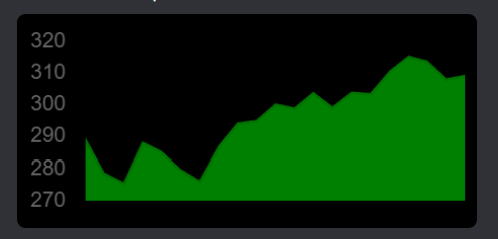
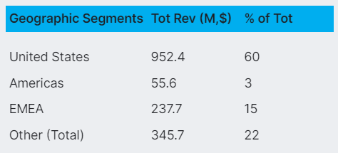
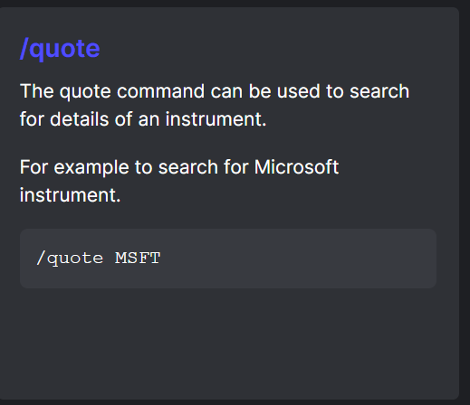

> **_:information_source: HERE Core UI:_** [HERE Core UI](https://resources.here.io/docs/core/hc-ui/) is a commercial product and this repo is for evaluation purposes (See [LICENSE.MD](../LICENSE.MD)). Use of the HERE Core Container and HERE Core UI components is only granted pursuant to a license from HERE (see [manifest](../public/manifest.fin.json)). Please [**contact us**](https://www.here.io/contact) if you would like to request a developer evaluation key or to discuss a production license.

[<- Back to Table Of Contents](../README.md)

# How To Customize Home Templates ?

Home templates can easily be customized, see [Customize Search Results In Home](https://resources.here.io/docs/core/hc-ui/home/customize/).

To provide more consistency with the way search results are displayed we provide a few ready to use template fragments that will pick up the colors from your platforms palette.

The template helpers are in [templates.ts](../client/src/framework/templates.ts).

All of the methods are strongly typed with the CSS properties so it is easy to provide additional styling to the entries.

## createContainer

Uses CSS flex box to create either a row or column.

## createTitle

Used for create a strong title at the top of a template.

## createText

Used for create a strong title at the top of a template.

## createImage

Used for displaying an image in the template.

## createButton

Used for adding a button to a template.

## createLabelledValue

Used for displaying a label/value pair.

## createTable

Used for displaying a table of data.

## createHelp

Used for creating a help entry result for when `?` query is used in Home

## Source Reference

- [templates.ts](../client/src/framework/templates.ts)
- [home.ts](../client/src/framework/workspace/home.ts)

[<- Back to Table Of Contents](../README.md)
