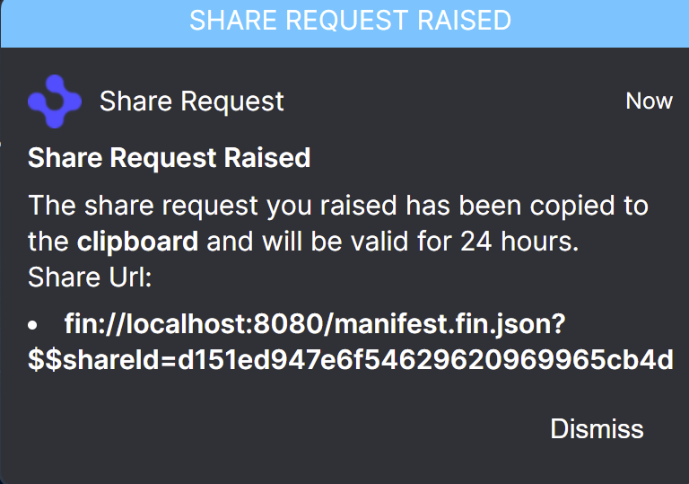
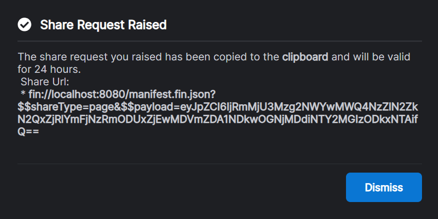
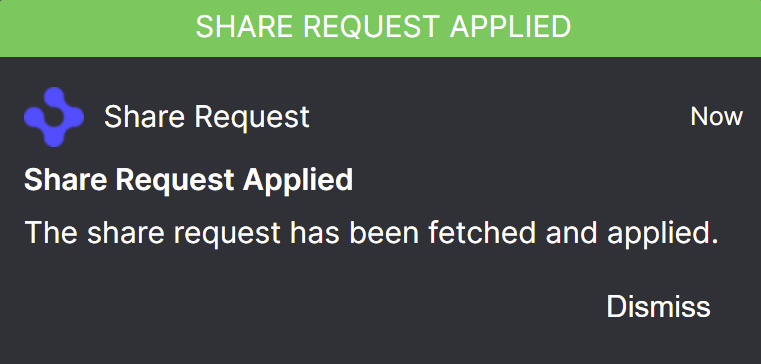
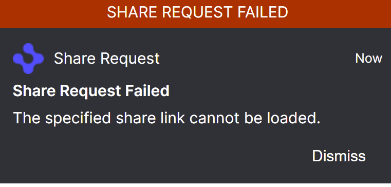

> **_:information_source: OpenFin Workspace:_** [OpenFin Workspace](https://www.openfin.co/workspace/) is a commercial product and this repo is for evaluation purposes (See [LICENSE.MD](../LICENSE.MD)). Use of the OpenFin Container and OpenFin Workspace components is only granted pursuant to a license from OpenFin (see [manifest](../public/manifest.fin.json)). Please [**contact us**](https://www.openfin.co/workspace/poc/) if you would like to request a developer evaluation key or to discuss a production license.

[<- Back to Table Of Contents](../README.md)

# What Is Sharing?

Providing the ability to share data between one platform and another can be customized with sharing. Sharing could be achieved by generating a link for some content that can shared with another user, on launching the link on a second platform the data will also be available there.

## Sharing can be customized through the `shareProvider` ?

By default sharing is enabled, but can be disabled using the following configuration:

```json
"shareProvider": {
  ...
  "enabled": false,
  ...
},
```

If you want to know if sharing is enabled you can use the global condition `sharing` in other areas of your platform.

## Extended Sharing With Modules

You can extend sharing by following the module pattern, see [How To Add A Module](./how-to-add-a-module.md) and adding them to the `shareProvider.modules` section.

A module for sharing pages could be added to the manifest as follows:

```json
"shareProvider": {
    "modules": [
        {
           "id": "pages-share",
            "icon": "http://localhost:8080/favicon.ico",
            "title": "Pages Share",
            "description": "Pages Share",
            "enabled": true,
            "url": "http://localhost:8080/js/modules/share/pages.bundle.js",
            "data": {
                "getEndpointId": "share-get",
                "setEndpointId": "share-set",
                "images": {
                    "error": "http://localhost:8080/common/icons/{theme}/{scheme}/error.svg",
                    "success": "http://localhost:8080/common/icons/{theme}/{scheme}/success.svg"
                }
            }
        }
    ]
}
```

## Implementation A Share Module

To implement a share module you should implement the `Share` interface.

```ts
export class MyShare implements Share {
  // Returns a list of types that the share module supports
  // e.g. "page"
  getShareTypes(): Promise<string[]>;

  // Returns a list of entries that appear when the share context menu is displayed
  // The windowIdentity is the entity which triggered the share request
  getEntries(windowIdentity: OpenFin.Identity): Promise<ShareEntry[] | undefined>;

  // Triggers the operation to perform the share, the type and payload
  // are the properties from the ShareEntry result from getEntries
  // This could generate a fins link or perform some other operation to
  // share the data with another platform
  share(type: string, payload?: unknown): Promise<void>;

  // When a platform receives the incoming data for a share
  // it should perform the necessary operations with it
  // for example a fins link which launches the platform
  // with a payload
  handle(type: string, payload?: unknown): Promise<void>;
}
```

There are example implementations for sharing a page and workspace in the following modules:

- [Workspace Share Module](../client/src/modules/share/workspaces/share.ts)
- [Page Share Module](../client/src/modules/share/pages/share.ts)

## Using The `sharing` Condition For A Toolbar Button

It is used when you define a browser button (see [How To Customize Browser Buttons](./how-to-customize-browser-buttons.md)) to allow your users to share and use conditions:

```json
"browserProvider": {
  ...
  "toolbarButtons": [
   ...,
   {
    "include": true,
    "id": "share",
    "button": {
     "type": "Custom",
     "tooltip": "Share",
     "disabled": false,
     "iconUrl": "http://localhost:8080/common/icons/{theme}/{scheme}/share.svg",
     "action": {
      "id": "share",
      "customData": {}
     }
    },
    "conditions": ["sharing"]
   },
   ...
  ]
 },

```

Here you can see that you can change the icon and tooltip for the share button. You should however keep the action and the condition the same unless you want to replace it with your own implementation.

This would give you the following icon and menu in the browser, the entries are sources from the `getEntries` method in the modules:


## If You Have Opted Into Home Workspace Or Page Management

If you have enabled workspace management (see [How To Workspace Platform Starter Management](./how-to-workspace-platform-starter-management.md)) or page management (see [How To Customize Browser Page Management](./how-to-customize-browser-page-management.md)) through home then the template will check to see if it should provide the option of sharing the workspace/page.

# Where Are Shared Workspaces/Pages Saved?

By default in our two examples we save the json data to an OpenFin cloud service. Additionally, strictly for development purposes, we provide a local server endpoint that can be used to test local payloads sent from the platform provider.

This service is not for production use and all saves are cleared after 24 hours. Please contact OpenFin if you would like to talk about this service.

The service is configured via endpoints (see [How To Define Endpoints](./how-to-define-endpoints.md)). The examples have the following defined:

Default configuration for use with the workspace platform provider using a remotely hosted demo endpoint:

```json
 "endpointProvider": {
  "modules": [

  ],
  "endpoints": [
   {
    "id": "share-get",
    "type": "fetch",
    "options": {
     "method": "GET",
     "url": "https://workspace.openfin.co/api/share/[id]"
    }
   },
   {
    "id": "share-set",
    "type": "fetch",
    "options": {
     "method": "POST",
     "url": "https://workspace.openfin.co/api/share"
    }
   }
  ]
 },

```

Alternate configuration containing the **local development server endpoint**:

```json
 "endpointProvider": {
  "modules": [

  ],
  "endpoints": [
   {
    "id": "share-get",
    "type": "fetch",
    "options": {
     "method": "GET",
     "url": "http://localhost:8080/api/share/[id]"
    }
   },
   {
    "id": "share-set",
    "type": "fetch",
    "options": {
     "method": "POST",
     "url": "http://loclahost:8080/api/share"
    }
   }
  ]
 },

```

## Endpoint Ids

Endpoints support an action and request/response function (see [How To Define Endpoints](./how-to-define-endpoints.md)). Workspace platform starter checks to see if you have specified the following endpoints when implementing sharing:

- share-get
- share-set

You can see we are using the default built in fetch support and passing fetch options via config.

Endpoints have a default **fetch** implementation where you can just point to rest endpoints but you could also have a custom module (see [how to add a module](./how-to-add-a-module.md) that implements your own logic.

## What Would The Share-Set Endpoint Need To Support?

### Request To Your Endpoint For Sharing A Page

Layout would be an object representing the page layout. It has been omitted to keep the snippet small:

```json
{
  "type": "page",
  "data": {
    "page": {
      "pageId": "0054ed07-4558-4600-a3ad-ddd6861d5eb8",
      "title": "Untitled Page",
      "layout": {}
    },
    "bounds": {
      "bottom": 583,
      "height": 500,
      "left": 574,
      "right": 1374,
      "top": 83,
      "width": 800
    }
  }
}
```

### Request To Your Endpoint For Sharing A Workspace

The snapshot is a workspace platform snapshot. MonitorInfo and Window details have been omitted for brevity.

```json
{
    "type": "workspace",
    "data": {
        "snapshot": {
            "snapshotDetails": {
                "timestamp": "2022-09-21T19:16:59.461Z",
                "runtimeVersion": "34.118.78.77",
                "monitorInfo": { ... },
            "windows": [
                { ... }
            ],
            "interopSnapshotDetails": {
                "contextGroupStates": {
                    "green": {},
                    "purple": {},
                    "orange": {},
                    "red": {},
                    "pink": {},
                    "yellow": {}
                }
            }
        }
    }
}
```

### Response From Your Endpoint

Your server should return a response in the following format:

```json
{ "id": "UniqueIDRepresentingSavedShare" }
```

or

```json
{ "url": "https://workspace.openfin.co/api/share/UniqueIDRepresentingSavedShare" }
```

**Workspace Platform Starter** will use the id if provided or will fall back to trimming the id from the returned **url**. The id will be passed to the endpoint that you have defined for **share-get**.

### What Would The User See After Raising A Share Request?

The confirmation displayed to a user for a successful share, or an error is under the control of the module. The `shareProvider` settings provide a default for the display mode, but this can be overridden by an individual model should it want to, it can be configured as follows.

```json
"shareProvider": {
  ...
  "confirmationMode": "notification",
  ...
},
```

When a share is successful or fails we use the confirmation to let the user know.



The url copied to the clipboard would be the url for your platform (it is localhost here as that was the environment used for the screenshot).

If a share is unsuccessful the user will see a notification:


If you changed the `confirmationMode` to `modal` you would see something more like the following:



## What Would The Share-Get Endpoint Need To Support?

### Request To Your Endpoint For Getting Share Data

You can decide if this is going to be a get request or a post. The example we have configured as share-get swaps out [id] for the id passed via the fins link or you could create your own custom endpoint to take the id and apply it in any way you want.

```json
https://workspace.openfin.co/api/share/UniqueIDRepresentingSavedShare
```

### Response Expected From Workspace Platform Starter For A Shared Page

Layout would be an object representing the page layout. It has been omitted to keep the snippet small:

```json
{
    "id": "UniqueIDRepresentingSavedShare",
    "createdAt": "2022-09-21T19:01:10.280Z",
    "type": "page",
    "data": {
        "page": {
            "pageId": "0054ed07-4558-4600-a3ad-ddd6861d5eb8",
            "title": "Untitled Page",
            "layout": { ... }
        },
        "bounds": {
            "bottom": 583,
            "height": 500,
            "left": 574,
            "right": 1374,
            "top": 83,
            "width": 800
        }
    }
}
```

Here you can see that the response is similar to the request to share. The id you provided and a createdAt entry is returned as well.

### Response Expected From Workspace Platform Starter For A Shared Workspace

The snapshot is a workspace platform snapshot. MonitorInfo and Window details have been omitted for brevity.

```json
{
    "id": "UniqueIDRepresentingSavedShare",
    "createdAt": "2022-09-21T19:17:00.201Z",
    "type": "workspace",
    "data": {
        "snapshot": {
            "snapshotDetails": {
                "timestamp": "2022-09-21T19:16:59.461Z",
                "runtimeVersion": "34.118.78.77",
                "monitorInfo": { ... },
            },
            "windows": [
                { ... }
            ],
            "interopSnapshotDetails": {
                "contextGroupStates": {
                    "green": {},
                    "purple": {},
                    "orange": {},
                    "red": {},
                    "pink": {},
                    "yellow": {}
                }
            }
        }
    }
}
```

Here you can see that the response is similar to the request to share. The id you provided and a createdAt entry is returned as well.

### What Would The User See After Applying A Share Request Via The Fins Link?

If the share was applied successfully they would see the page/workspace launch and receive a notification:



If there is a problem fetching or applying the share then the user will be notified through a notification.



## Generate From Template

You can generate the scaffold for a new module by using the following command line, where "My Share" is the name you want to give your module:

```shell
npm run generate-module share "My Share"
```

## Source Reference

- [share.ts](../client/src/framework/share.ts)
- [Workspace Share Module](../client/src/modules/share/workspaces/share.ts)
- [Page Share Module](../client/src/modules/share/pages/share.ts)

[<- Back to Table Of Contents](../README.md)
