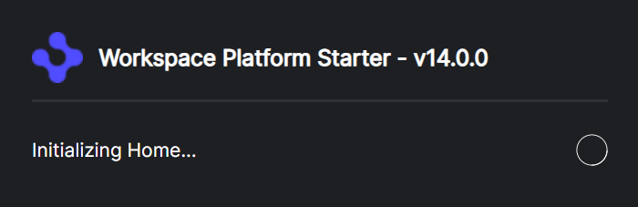

> **_:information_source: OpenFin Workspace:_** [OpenFin Workspace](https://www.openfin.co/workspace/) is a commercial product and this repo is for evaluation purposes (See [LICENSE.MD](../LICENSE.MD)). Use of the OpenFin Container and OpenFin Workspace components is only granted pursuant to a license from OpenFin (see [manifest](../public/manifest.fin.json)). Please [**contact us**](https://www.openfin.co/workspace/poc/) if you would like to request a developer evaluation key or to discuss a production license.

[<- Back to Table Of Contents](../README.md)

# How To Customize the Splash Screen

When the platform is starting a splash screen is displayed, the splash screen automatically updates based on the component that is currently being initialized.



You can disable the splash screen with the following option.

```json
{
   "splashScreenProvider": {
      ...
      "disabled": true,
   }
}
```

The following properties can be configured to change the style and content of the splash screen. All of the properties have sensible defaults, and do not need to be configured.

```json
{
   "splashScreenProvider": {
     ...
     "title": "My Platform", // Defaults to platform title
     "icon": "http://localhost:8080/favicon.png", // Defaults to platform icon
     "width": 200, // Defaults to 400
     "height": 200, // Defaults to 130
     "backgroundColor": "#FFFFFF", // Defaults to platform theme backgroundPrimary
     "textColor": "#000000", // Defaults to platform theme textDefault
     "borderColor": "#EEEEEE" // Defaults to platform theme background4
   }
}
```

If you want to change the layout of the splash screen completely you could modify [../public/platform/splash.html](../public/platform/splash.html)

## Initializing the UI

To enable support for cross domain connectivity in the splash window, the style from the `splashScreenProvider` is combined with sensible default options and passed to the window. Within the HTML you should use these value to populate the style and content.

e.g. in your splash screen HTML file

```js
<script>
(async () => {
   try {
      const options = await fin.me.getOptions();

      setupStyle(options.customData.style);
   } catch (err) {
      console.error(err);
   }

   function setupStyle(style) {
      document.title = style.title;

      const iconElem = document.querySelector('#icon');
      if (iconElem) {
         iconElem.src = style.icon;
      }

      const headingElem = document.querySelector('#heading');
      if (headingElem) {
         headingElem.textContent = style.title;
      }

      if (style.backgroundColor) {
         document.body.style.backgroundColor = style.backgroundColor;
      }

      if (style.textColor) {
         if (headingElem) {
            headingElem.style.color = style.textColor;
         }
         const progressElem = document.querySelector('#progress');
         if (progressElem) {
            progressElem.style.color = style.textColor;
         }
         const loaderElem = document.querySelector('#loader');
         if (loaderElem) {
            loaderElem.style.color = style.textColor;
         }
      }

      if (style.borderColor) {
         const headerElem = document.querySelector('header');
         if (headerElem) {
            headerElem.style.borderBottomColor = style.borderColor;
         }
      }
   }
})();
</script>
```

## Progress Updates

To update the progress field in the splash screen the platform sends channel messages that the splash window can use. The name of the channel is sent in the window options, and updates are sent through the `progress` topic.

```js
<script>
(async () => {
   try {
      const options = await fin.me.getOptions();

      await setupChannel(options.customData.channelName);
   } catch (err) {
      console.error(err);
   }

   async function setupChannel(channelName) {
      if (channelName) {
         const channel = await fin.InterApplicationBus.Channel.connect(channelName);
         await channel.register('progress', (payload) => {
            const progress = document.querySelector('#progress');
            if (progress) {
               progress.textContent = `Initializing ${payload.progress}...`;
            }
         });
      }
   }
})();
</script>
```

## Source Reference

- [platform-splash.ts](../client/src/framework/platform/platform-splash.ts)
- [splash.html](../public/platform/splash.html)

[<- Back to Table Of Contents](../README.md)
