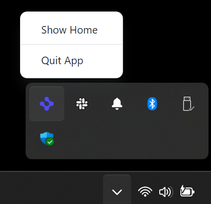

> **_:information_source: OpenFin Workspace:_** [OpenFin Workspace](https://www.openfin.co/workspace/) is a commercial product and this repo is for evaluation purposes (See [LICENSE.MD](../LICENSE.MD)). Use of the OpenFin Container and OpenFin Workspace components is only granted pursuant to a license from OpenFin (see [manifest](../public/manifest.fin.json)). Please [**contact us**](https://www.openfin.co/workspace/poc/) if you would like to request a developer evaluation key or to discuss a production license.

[<- Back to Table Of Contents](../README.md)

# How To Customize the Tray Icon

The platform has the ability to configure a tray icon should you want one. The tray icon can have a default action when you click it or it can display a menu.



You can enable the splash screen with the following option.

```json
{
   "trayProvider": {
      ...
      "enabled": true,
   }
}
```

You can override the icon for the tray, it will default to the platform icon if not provided. You can also specify which mouse button left/right/any button will activate the actions.

```json
{
   "trayProvider": {
      ...
      "icon": "http://localhost:8080/favicon.png", // Defaults to platform icon
      "activateButton": "right" // Defaults to "any"
   }
}
```

The operation of the icon can either be a single action, or it can display a menu with multiple actions.

For a single action configure as follows:

```json
{
   "trayProvider": {
      ...
      "defaultAction": {
         "id": "quit",
         "customData": {
            "prop1": true
         }
      }
   }
}
```

To display a menu we use the same format as the menus in the browser window (see [How to Customize Browser Menus](./how-to-customize-browser-menus.md))

The menu shown in the screen-shot above would be configured as follows:

```json
{
   "trayProvider": {
      ...
      "menuEntries": [
        {
           "include": true,
           "label": "Show Home",
           "position": {
              "operation": "end"
            },
            "data": {
               "type": "Custom",
               "action": {
                  "id": "home-show"
               }
            },
            "separator": "after"
        },
        {
            "include": true,
            "label": "Quit App",
            "position": {
               "operation": "end"
            },
             "data": {
               "type": "Custom",
               "action": {
                  "id": "quit"
               }
            }
         }
      ]
   }
}
```

## Source Reference

- [tray.ts](../client/src/framework/tray.ts)

[<- Back to Table Of Contents](../README.md)
