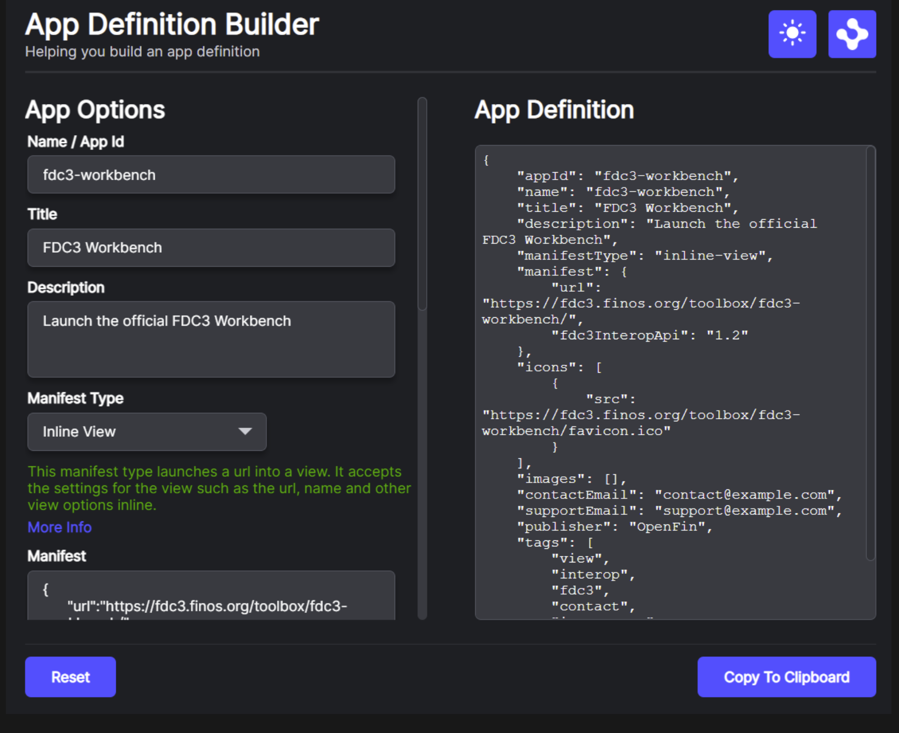

> **_:information_source: OpenFin Workspace:_** [OpenFin Workspace](https://www.openfin.co/workspace/) is a commercial product and this repo is for evaluation purposes (See [LICENSE.MD](../LICENSE.MD)). Use of the OpenFin Container and OpenFin Workspace components is only granted pursuant to a license from OpenFin (see [manifest](../public/manifest.fin.json)). Please [**contact us**](https://www.openfin.co/workspace/poc/) if you would like to request a developer evaluation key or to discuss a production license.
> OpenFin Workspace is currently **only supported on Windows** although you can run the sample on a Mac for development purposes.

[<- Back to Table Of Contents](../README.md)

# How To Define Apps

You have a number of choices when choosing how you define your apps.

- Platform App Definition (defined below)
- [FDC3 1.2 App Definition](./how-to-define-apps-fdc3-1-2.md)
- [FDC3 2.0 App Definition](./how-to-define-apps-fdc3-2-0.md)

## Platform App Definition

The Platform App definition for a workspace platform is based on the FDC3 1.2 App definition with some additional extensions (such as tags, private, autostart, and instanceMode). It is the structure used internally.

Using workspace platform starter an app definition can easily be added to an [apps.json](../public/apps.json) file and it will be automatically picked up alongside a collection of [common apps](../public/common/apps.json).

### What Does An App Definition Look Like?

An app exists within an array that is returned as part of request.

```json
[
  {
    "appId": "fdc3-workbench",
    "name": "fdc3-workbench",
    "title": "FDC3 Workbench",
    "description": "Launch the official FDC3 Workbench",
    "manifest": "http://localhost:8080/common/views/fdc3/workbench/fdc3-workbench.view.fin.json",
    "manifestType": "view",
    "private": false,
    "autostart": false,
    "icons": [
      {
        "src": "https://fdc3.finos.org/toolbox/fdc3-workbench/favicon.ico"
      }
    ],
    "contactEmail": "contact@example.com",
    "supportEmail": "support@example.com",
    "publisher": "OpenFin",
    "intents": [
      {
        "name": "ViewContact",
        "displayName": "View Contact",
        "contexts": ["fdc3.contact"],
        "customConfig": {}
      },
      {
        "name": "ViewInstrument",
        "displayName": "View Instrument",
        "contexts": ["fdc3.instrument"],
        "customConfig": {}
      }
    ],
    "images": [
      {
        "src": "http://localhost:8080/common/images/previews/fdc3-workbench.png"
      }
    ],
    "tags": ["view", "interop", "fdc3", "contact", "instrument"]
  }
]
```

The following fields are mandatory:

- appId - helps identify the application in platform
- name - serves a similar purpose to appId
- title - used to identify the app when searching or browsing
- manifestType - what type of application is this (this can be extended by a platform and workspace-platform-starter supports a number of manifestTypes)
- manifest - this can be a url to a json endpoint or it can be a JSON object. Customize uses the manifest type inline-\* to indicate when the intention is to pass the payload directly.

The following field is custom to this platform and is optional:

- private - default value is false. Should this app entry be available for api usage (e.g. intents) but not be visible in e.g. Home, Store, Dock? Similar to how a private npm package can be used by some people but not everyone.
- autostart - default value is false. Should this app be launched after bootstrapping.
- instanceMode - default mode is multi. Value can be "single"|"multi"|"new" (new means a new instance will be created if an intent is raised and the app specified but no instance id even if there are existing instances. The intent picker will also not show instances as the app provider has indicated they want to just launch a new instance).
- interop - this is the interop structure used by an fdc3 2.0 app and allows richer metadata to be specified to indicate an app's interop support.
- customConfig - a name value pair. We don't use it but it could be used by extensions.
- tooltip - to match fdc3 1.2 and 2.0 definitions
- moreInfo - to match additional information provided by fdc3 2.0 apps
- name - not actively used (more as a fallback) but supported for fdc3 1.2 or 2.0 mappings.

The rest of the fields are self explanatory but the intents array deserves more detail.

## Intents

An application can specify that it supports being launched to support certain workflows. These are defined as intents.

There are a number of intents supported by the FDC3 standard (ViewContact and ViewInstrument are shown in the example above) but you can also define custom intents for your organization. If your app meta data specifies that it supports an intent then it should listen for that intent and react to it. We cover more in the [How To Add Intent Support To Your App](./how-to-add-intent-support-to-your-app.md).

If a second application raises an intent then the workspace platform will check to see if any applications support the workflow. If only one app entry supports it then the platform will launch it. If there is more than one option then it will present the list of options to the end user. You can customize the UI presented to the user and we will cover that in the [How To Configure FDC3 Intents Page](./how-to-configure-fdc3-intents.md).

## How To Create An App Definition

### Manually

To create an app definition you could simply copy the json object above modify it and add it to [apps.json](../public/apps.json).

### Using The App Definition Builder

If you launch the default instance of workspace-platform-starter either locally or from the live launch section of our main [README.md](../README.md) then you will be able to type App Definition Builder into home and you will be presented with a UI to help you build the JSON. You can also type Getting Started if you want to see App Definition Builder alongside other utility apps.



> **_:information_source: Manifest Types:_** If you use App Definition builder it will offer you a drop down of the manifest types supported (otherwise please see the list of supported manifest types below). If you are defining a view (url to load into browser) or a window (without the OpenFin Browser chrome) then there is the option of embedding the settings when you specify the manifest property. These would either be [Window Options](https://developer.openfin.co/docs/javascript/stable/Window.html#~options) or [View Options](https://developer.openfin.co/docs/javascript/stable/View.html#~options). If you are simply using window or view then the manifest setting should point to a url that provides the settings in JSON format.

### Manifest Types

We support a number of manifestTypes which can be seen in [What Manifest Types Are Supported](./what-manifest-types-are-supported.md).

## How To Configure The AppProvider For Your Platform

The app provider definition can either come from your manifest or from an external settings service (see [How To Apply Entitlements](./how-to-apply-entitlements.md) and an example is available via [second.manifest.fin.json](../public/second.manifest.fin.json) and [settings.json](../public/settings.json)). The available settings are as follows:

| Property                         | Description                                                                                                                                                                                                                                                                                                                                                                                                                                                                                                                                                                    |
| -------------------------------- | ------------------------------------------------------------------------------------------------------------------------------------------------------------------------------------------------------------------------------------------------------------------------------------------------------------------------------------------------------------------------------------------------------------------------------------------------------------------------------------------------------------------------------------------------------------------------------ |
| **appProvider**                  | Config related to where the apps should be fetched from                                                                                                                                                                                                                                                                                                                                                                                                                                                                                                                        |
| appsSourceUrl (legacy)           | Where should we fetch the apps from. It is a url or an array of urls from which to get apps data from. If present it will be used instead of endpointIds (shown below).                                                                                                                                                                                                                                                                                                                                                                                                        |
| includeCredentialOnSourceRequest | Should we include credentials when doing the search request. Options: "omit", "same-origin", "include". Used when appsSourceUrl is specified or a url is used as an endpointId.                                                                                                                                                                                                                                                                                                                                                                                                |
| endpointIds                      | An array of endpoint ids that should be used to request a list of apps (this replaces appsSourceUrl), an array of urls to fetch the apps (the url response can be an array in platform app format or an expected fdc3 1.2 or 2.0 response) or an object that provides an "inputId" and "outputId". If specified then the platform will fetch a response from an inputId endpoint and then pass it to the outputId endpoint which will return a list of Apps in the format we expect (this can be used to map app directories if the app directory supports a specific format). |
| cacheDurationInMinutes           | How many minutes should we wait before refreshing the list from the server? Can be used on it's own or with cacheDurationInSeconds.                                                                                                                                                                                                                                                                                                                                                                                                                                            |
| cacheDurationInSeconds           | How many seconds should we wait before refreshing the list from the server? Can be used on it's own or with cacheDurationInMinutes.                                                                                                                                                                                                                                                                                                                                                                                                                                            |
| manifestTypes                    | An array of the manifestTypes the app should support from the apps.json feed                                                                                                                                                                                                                                                                                                                                                                                                                                                                                                   |

### An Example Of What These Settings Would Look Like (Taken From [manifest.fin.json](../public/manifest.fin.json))

```json
    "appProvider": {
            "endpointIds": ["http://localhost:8080/apps.json", "common-apps-get"],
            "cacheDurationInSeconds": 10,
            "cacheDurationInMinutes": 0,
            "manifestTypes": [
             "view",
             "inline-view",
             "window",
             "inline-window",
             "snapshot",
             "inline-snapshot",
             "external",
             "inline-external",
             "appasset",
             "inline-appasset",
             "manifest",
             "desktop-browser",
             "connection"
           ]
        },
```

The configuration above shows that it doesn't enable all of the manifest types that workspace-platform-starter supports. It is also using endpoints (see [How To Define Endpoints](./how-to-define-endpoints.md)) for one of the entries and a url for the other. The endpoint here is defined as common-apps-get. An endpoint lets you provide a custom implementation or use our builtin fetch support. Here is a snippet of what that looks like in the settings:

```json
"endpointProvider": {
    "modules": [
    ],
    "endpoints": [
        {
            "id": "common-apps-get",
            "type": "fetch",
            "options": {
                "method": "GET",
                "url": "http://localhost:8080/common/apps.json"
            }
        }
    ]
},
```

These endpoints are using the built in fetch support and the options are passed to fetch options in order to get back the JSON list of app entries.

### Do I need a rest endpoint if I just want to add a few quick apps?

Our local setup provides an apps.json file for you to use but we also provide an endpoint (see [how to define endpoints](./how-to-define-endpoints.md)) module that lets you add inline apps via the manifest.

The endpoint module is called **inline-apps** and it lets you specify an array of apps (they must be in our platform app format) via the endpoint options setting:

```json
"endpointProvider": {
    "modules": [
        {
            "enabled": true,
            "id": "inline-apps",
            "url": "http://localhost:8080/js/modules/endpoints/inline-apps.bundle.js"
        }
    ],
    "endpoints": [
        {
            "id": "inline-apps-get",
            "type": "module",
            "typeId": "inline-apps",
            "options": {
                "apps": [
                    {
                        "appId": "inline-app-example",
                        "name": "inline-app-example",
                        "title": "Inline App Example",
                        "description": "An application added via the manifest or a settings rest endpoint by using the inline-apps endpoint module.",
                        "manifest": {
                            "url": "https://www.openfin.co"
                        },
                        "manifestType": "inline-view",
                        "icons": [
                            {
                            "src": "http://localhost:8080/common/images/icon-blue.png"
                            }
                        ],
                        "contactEmail": "contact@example.com",
                        "supportEmail": "support@example.com",
                        "publisher": "OpenFin",
                        "intents": [],
                        "images": [],
                        "tags": ["inline-app-example", "view"]
                    }
                ]
            }
        }
    ]
},
```

In the above example we would have the following app endpointId definition:

```json
    "appProvider": {
            "endpointIds": ["inline-apps-get"],
            ...
        },
```

The inline-apps endpoint module can be seen [here](../client/src/modules/endpoints/inline-apps/endpoint.ts).

## Where Are Apps Used?

Apps can come from many sources but the feed can be used by:

- Workspace Home - To present the user with a list of apps that they can filter and launch (if the private setting is unset or false).
- Workspace Store - Apps can be used to populate sections of the store so people can browse in order to see what they are entitled to (if the private setting is unset or false).
- Workspace Dock - Apps can be pinned to or listed from the Dock in order to give an easy way of launching common applications (if the private setting is unset or false).
- The platform's Interop Broker for supporting the launching of Intents (the broker can look up any app regardless of whether it is marked private or not).

Our guides show how to:

- [Configure Dock](./how-to-customize-dock.md)
- [Configure Home](./how-to-customize-home.md)
- [Configure Store](./how-to-customize-store.md)

## Source Reference

- [apps.ts](../client/src/framework/apps.ts)
- [directory.ts](../client/src/framework/directory.ts)
- [inline-apps/endpoint.ts](../client/src/modules/endpoints/inline-apps/endpoint.ts)

[<- Back to Table Of Contents](../README.md)
