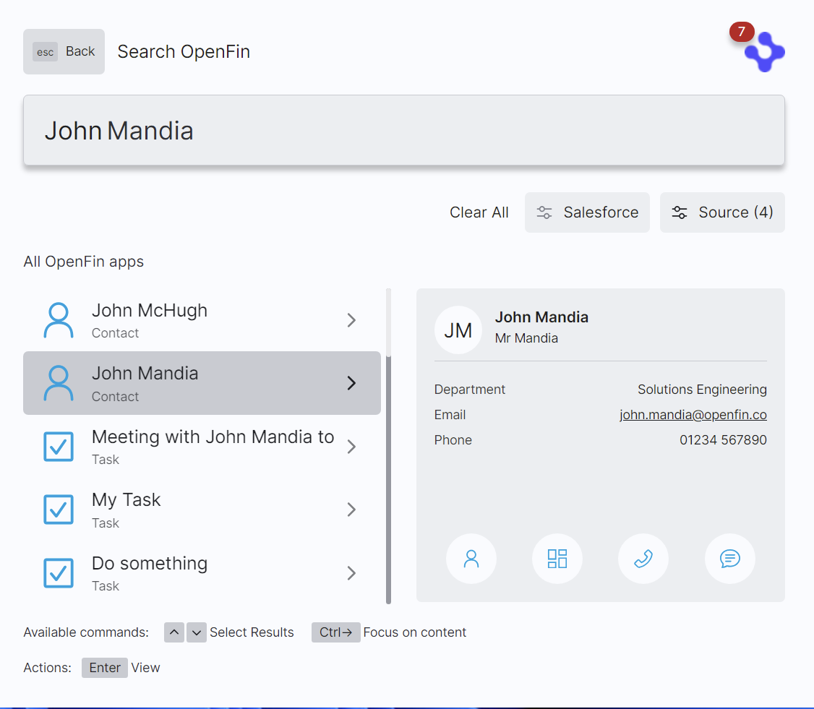
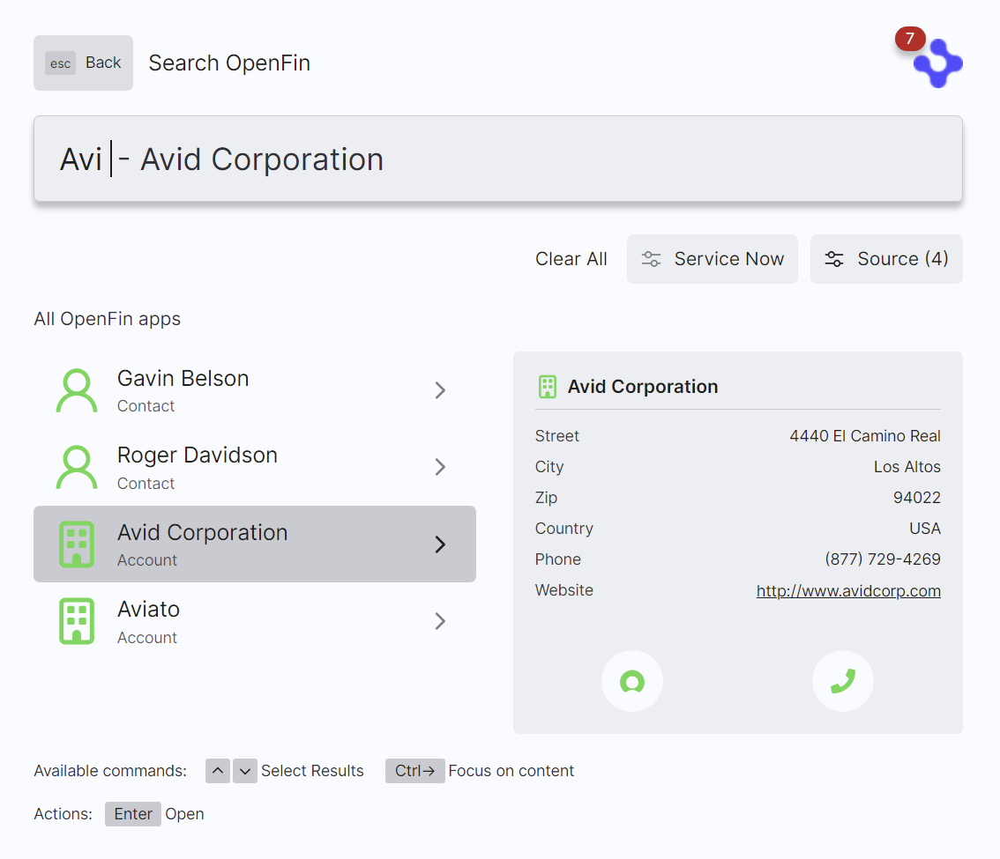
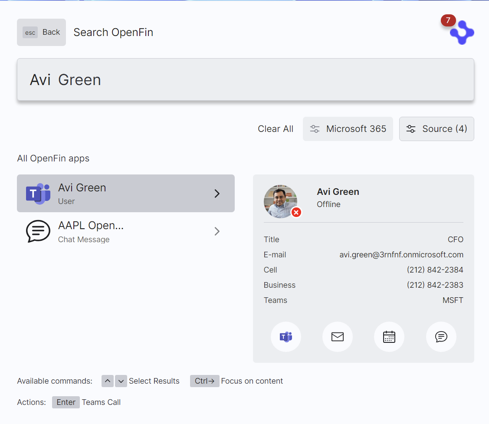

> **_:information_source: OpenFin Workspace:_** [OpenFin Workspace](https://www.openfin.co/workspace/) is a commercial product and this repo is for evaluation purposes (See [LICENSE.MD](../LICENSE.MD)). Use of the OpenFin Container and OpenFin Workspace components is only granted pursuant to a license from OpenFin (see [manifest](../public/manifest.fin.json)). Please [**contact us**](https://www.openfin.co/workspace/poc/) if you would like to request a developer evaluation key or to discuss a production license.

[<- Back to Table Of Contents](../README.md)

# How To Add Salesforce, ServiceNow or MS365 support to Home?

Workspace has built-in support for MS365 through our [low code implementation](./how-to-setup-low-code-integrations.md) and this can be configured in Workspace Platform Starter. OpenFin also offers npm packages that make it easy to integrate with other platforms and we have examples on how to use our [Salesforce](../../integrate-with-salesforce/README.md), [ServiceNow](../../integrate-with-servicenow/README.md), and [MS365](../../integrate-with-ms365/README.md) npm packages. These examples are built and published on github.io and the following section shows how they can be added to a manifest (or through a settings service).

## Salesforce

Our Salesforce example already exists in the main [manifest.fin.json](../public/manifest.fin.json) in the integrationProvider section. It is disabled and would need to be enabled and the details about your Salesforce Organization would need to be added.

```json
 {
     "id": "salesforce",
     "icon": "https://built-on-openfin.github.io/workspace-starter/workspace/v19.0.0/integrate-with-salesforce/favicon.ico",
     "title": "Salesforce",
     "enabled": false,
     "url": "https://built-on-openfin.github.io/workspace-starter/workspace/v19.0.0/integrate-with-salesforce/js/modules/integrations/salesforce.bundle.js",
     "data": {
      "appId": "",
      "consumerKey": "",
      "orgUrl": "",
      "preload": "https://built-on-openfin.github.io/workspace-starter/workspace/v19.0.0/integrate-with-salesforce/js/preload.js",
      "enableLibLogging": true,
      "iconMap": {
       "salesforce": "https://built-on-openfin.github.io/workspace-starter/workspace/v19.0.0/integrate-with-salesforce/images/salesforce.svg",
       "contact": "https://built-on-openfin.github.io/workspace-starter/workspace/v19.0.0/integrate-with-salesforce/images/contact.svg",
       "account": "https://built-on-openfin.github.io/workspace-starter/workspace/v19.0.0/integrate-with-salesforce/images/account.svg",
       "chatter": "https://built-on-openfin.github.io/workspace-starter/workspace/v19.0.0/integrate-with-salesforce/images/chatter.svg",
       "note": "https://built-on-openfin.github.io/workspace-starter/workspace/v19.0.0/integrate-with-salesforce/images/note.svg",
       "task": "https://built-on-openfin.github.io/workspace-starter/workspace/v19.0.0/integrate-with-salesforce/images/task.svg",
       "dashboard": "https://built-on-openfin.github.io/workspace-starter/workspace/v19.0.0/integrate-with-salesforce/images/dashboard.svg",
       "phone": "https://built-on-openfin.github.io/workspace-starter/workspace/v19.0.0/integrate-with-salesforce/images/phone.svg",
       "chat": "https://built-on-openfin.github.io/workspace-starter/workspace/v19.0.0/integrate-with-salesforce/images/chat.svg",
       "email": "https://built-on-openfin.github.io/workspace-starter/workspace/v19.0.0/integrate-with-salesforce/images/email.svg"
      }
     }
    },
```

This examples supports a number of configuration settings (covered in the sample) so that you can adapt it to your needs. It can give you a UI similar to the following:



### Add Intent Support to search results

If you wish to have content launched from the Salesforce integration to be an intent target for ViewContact/ViewProfile then you will need:

- An app definition - We have included one in [apps-connector.json](../public/common/apps-connector.json) although you will need to add your salesforce org url. You will also need to add the [apps-connector.json](../public/common/apps-connector.json) directory to your [appsProvider](./what-is-an-apps-provider.md) so that it is included when looking up which applications support ViewContact/ViewProfile.
- Add the appId (salesforce-app is the id we use in our apps-connector.json file) to the salesforce integration entry in your manifest or settings file. This will tell the integration to launch Salesforce urls as part of the app.

### Preload scripts

In the integration definition and the salesforce app definition you will see a reference to preload scripts. If you are using a [Lightning Web Security Salesforce application](https://developer.salesforce.com/docs/platform/lwc/guide/security-lwsec-intro.html) then you can delete the preload script entries as they are not needed. For more information about the OpenFin SalesForce app which simplifies Salesforce integration please visit: <https://developers.openfin.co/of-docs/docs/salesforce-appexchange>.

## ServiceNow

Our ServiceNow example already exists in the main [manifest.fin.json](../public/manifest.fin.json) in the integrationProvider section. It is disabled and would need to be enabled and the details about your ServiceNow setup would need to be added.

```json
{
  "id": "servicenow",
  "icon": "https://built-on-openfin.github.io/workspace-starter/workspace/v19.0.0/integrate-with-servicenow/favicon.ico",
  "title": "ServiceNow",
  "enabled": false,
  "url": "https://built-on-openfin.github.io/workspace-starter/workspace/v19.0.0/integrate-with-servicenow/js/integrations/servicenow.bundle.js",
  "data": {
    "instanceUrl": "",
    "clientId": "",
    "enableLibLogging": true,
    "images": {
      "servicenow": "https://built-on-openfin.github.io/workspace-starter/workspace/v19.0.0/integrate-with-servicenow/images/apps/servicenow.svg",
      "contact": "https://built-on-openfin.github.io/workspace-starter/workspace/v19.0.0/integrate-with-servicenow/images/types/contact.svg",
      "account": "https://built-on-openfin.github.io/workspace-starter/workspace/v19.0.0/integrate-with-servicenow/images/types/account.svg",
      "case": "https://built-on-openfin.github.io/workspace-starter/workspace/v19.0.0/integrate-with-servicenow/images/types/case.svg",
      "task": "https://built-on-openfin.github.io/workspace-starter/workspace/v19.0.0/integrate-with-servicenow/images/types/task.svg",
      "incident": "https://built-on-openfin.github.io/workspace-starter/workspace/v19.0.0/integrate-with-servicenow/images/types/incident.svg",
      "call": "https://built-on-openfin.github.io/workspace-starter/workspace/v19.0.0/integrate-with-servicenow/images/icons/call.svg",
      "email": "https://built-on-openfin.github.io/workspace-starter/workspace/v19.0.0/integrate-with-servicenow/images/icons/email.svg"
    }
  }
}
```



## MS365

Our MS365 Example is similar to the low code implementation. It shows you how you can query the graph API and return templated results into Home.

Our MS365 example already exists in the main [manifest.fin.json](../public/manifest.fin.json) in the integrationProvider section. It is disabled and would need to be enabled and the details about your MS365 setup would need to be added.

```json
{
  "id": "ms365",
  "icon": "https://built-on-openfin.github.io/workspace-starter/workspace/v19.0.0/integrate-with-ms365/favicon.ico",
  "title": "Microsoft 365",
  "enabled": false,
  "url": "https://built-on-openfin.github.io/workspace-starter/workspace/v19.0.0/integrate-with-ms365/js/integrations/ms365.bundle.js",
  "data": {
    "clientId": "",
    "tenantId": "",
    "redirectUri": "http://localhost:8080/oauth_redirect.html",
    "permissions": [
      "User.Read",
      "Presence.Read",
      "Presence.Read.All",
      "Directory.Read.All",
      "Mail.ReadWrite",
      "Contacts.Read",
      "Tasks.Read",
      "Calendars.ReadWrite",
      "Chat.Read",
      "ChannelMessage.Read.All",
      "TeamMember.Read.All",
      "ChannelMember.Read.All",
      "Files.Read.All",
      "Sites.Read.All"
    ],
    "disableGraphExplorer": false,
    "enableLibLogging": true,
    "images": {
      "microsoft365": "https://built-on-openfin.github.io/workspace-starter/workspace/v19.0.0/integrate-with-ms365/images/apps/microsoft365.svg",
      "teams": "https://built-on-openfin.github.io/workspace-starter/workspace/v19.0.0/integrate-with-ms365/images/apps/teams.svg",
      "word": "https://built-on-openfin.github.io/workspace-starter/workspace/v19.0.0/integrate-with-ms365/images/apps/word.svg",
      "excel": "https://built-on-openfin.github.io/workspace-starter/workspace/v19.0.0/integrate-with-ms365/images/apps/excel.svg",
      "onenote": "https://built-on-openfin.github.io/workspace-starter/workspace/v19.0.0/integrate-with-ms365/images/apps/onenote.svg",
      "powerpoint": "https://built-on-openfin.github.io/workspace-starter/workspace/v19.0.0/integrate-with-ms365/images/apps/powerpoint.svg",
      "outlook": "https://built-on-openfin.github.io/workspace-starter/workspace/v19.0.0/integrate-with-ms365/images/apps/outlook-mail.svg",
      "email": "https://built-on-openfin.github.io/workspace-starter/workspace/v19.0.0/integrate-with-ms365/images/icons/email.svg",
      "calendar": "https://built-on-openfin.github.io/workspace-starter/workspace/v19.0.0/integrate-with-ms365/images/icons/calendar.svg",
      "share": "https://built-on-openfin.github.io/workspace-starter/workspace/v19.0.0/integrate-with-ms365/images/icons/share.svg",
      "chat": "https://built-on-openfin.github.io/workspace-starter/workspace/v19.0.0/integrate-with-ms365/images/icons/chat.svg",
      "call": "https://built-on-openfin.github.io/workspace-starter/workspace/v19.0.0/integrate-with-ms365/images/icons/call.svg",
      "contact": "https://built-on-openfin.github.io/workspace-starter/workspace/v19.0.0/integrate-with-ms365/images/icons/contact.svg",
      "team": "https://built-on-openfin.github.io/workspace-starter/workspace/v19.0.0/integrate-with-ms365/images/icons/team.svg",
      "file": "https://built-on-openfin.github.io/workspace-starter/workspace/v19.0.0/integrate-with-ms365/images/icons/file.svg",
      "folder": "https://built-on-openfin.github.io/workspace-starter/workspace/v19.0.0/integrate-with-ms365/images/icons/folder.svg",
      "channel": "https://built-on-openfin.github.io/workspace-starter/workspace/v19.0.0/integrate-with-ms365/images/icons/channel.svg",
      "clock": "https://built-on-openfin.github.io/workspace-starter/workspace/v19.0.0/integrate-with-ms365/images/icons/clock.svg",
      "check": "https://built-on-openfin.github.io/workspace-starter/workspace/v19.0.0/integrate-with-ms365/images/icons/check.svg",
      "cross": "https://built-on-openfin.github.io/workspace-starter/workspace/v19.0.0/integrate-with-ms365/images/icons/cross.svg"
    }
  }
}
```



## Further Information

To know more about how custom integrations can be added to Home please see [How to Add Integrations to Home](./how-to-add-integrations-to-home.md).

To know more about our integrations please visit the content on the OpenFin website:

- [Salesforce Integration](https://developers.openfin.co/of-docs/docs/salesforce-integration)
- [ServiceNow Integration](https://developers.openfin.co/of-docs/docs/servicenow-integration)
- [MS365 Integration](https://developers.openfin.co/of-docs/docs/ms365-integration)

[<- Back to Table Of Contents](../README.md)
