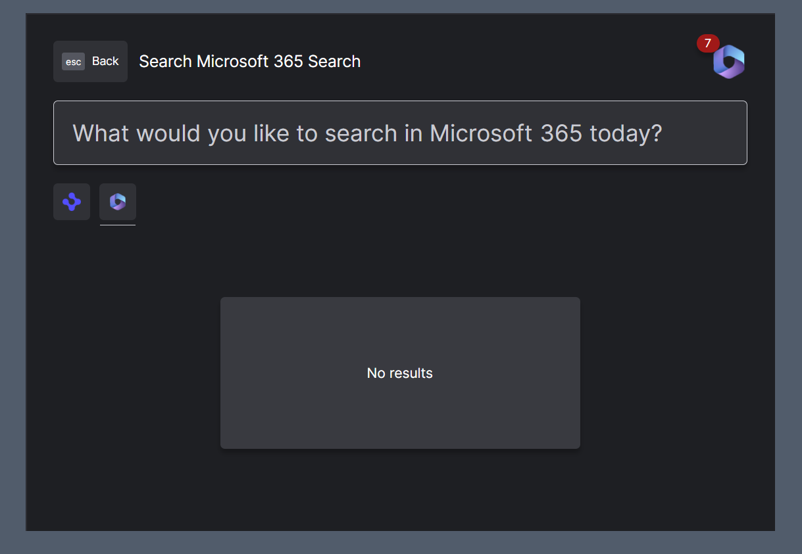

> **_:information_source: OpenFin Workspace:_** [OpenFin Workspace](https://www.openfin.co/workspace/) is a commercial product and this repo is for evaluation purposes (See [LICENSE.MD](../LICENSE.MD)). Use of the OpenFin Container and OpenFin Workspace components is only granted pursuant to a license from OpenFin (see [manifest](../public/manifest.fin.json)). Please [**contact us**](https://www.openfin.co/workspace/poc/) if you would like to request a developer evaluation key or to discuss a production license.
> OpenFin Workspace is currently **only supported on Windows** although you can run the sample on a Mac for development purposes.

[<- Back to Table Of Contents](../README.md)

# How To Setup Low Code Integrations?

Workspace now includes support for low code workflows from version 13.1+ of OpenFin Workspace. Examples of how easy it is to enable these low code integrations can be found in [integrate-with-ms365-low-code](../integrate-with-ms365-low-code/) and [integrate-with-ms365-low-code-basic](../integrate-with-ms365-low-code-basic/) and in this example platform we have made it purely config based. For more information about Low Code Integrations please see [Working with OpenFin's Microsoft Low Code Integration](https://developers.openfin.co/of-docs/docs/microflows-microsoft).



The code for the low code integration provider can be found in [low-code-integrations.ts](../client/src/framework/workspace/low-code-integrations.ts), `register` is called as part of the app platform initialization as low code integrations need to be passed as part of a platform's config. If you want low code integrations registered after your own home registration then you can set your entry to not auto initialize. If you want home to autoShow after registration (even if you have not got your own home registration) then remember to put autoShow: ["home"] in your bootstrap configuration and add it to the end of the array if there are multiple entries.

## Enabling Low Code Integrations

To enable low code integrations you need to add a lowCodeIntegrationProvider section to your customSettings. We generate schemas that can be used in your manifest and settings.json file to give you intellisense (you can see an example in our main [manifest.fin.json](../public/manifest.fin.json)).

```json
"lowCodeIntegrationProvider": {
   "modules": [{
    "id": "ms365",
    "title": "Microsoft 365 Low Code Integration",
    "type": "ms365",
    "enabled": false,
    "data": {
     "connect": {
      "clientId": "",
      "tenantId": "",
      "redirectUri": ""
     },
     "workflows": {
      "search": {
       "disableAutoInitialize": true
      }
     }
    }
   }]
  }
```

In the example above we have provided the modules array with a single entry. This entry is to use the MS365 low code integration (specified via the type) and the data within it is the settings required when registering a low code integration. In the example of the Microsoft 365 Low Code Integration you still need to ensure you have the Microsoft tenant and all the related permissions setup. Please see [Working with OpenFin's Microsoft Low Code Integration](https://developers.openfin.co/of-docs/docs/microflows-microsoft). You'll notice we have specified disableAutoInitialize. This is because we want the Low Code Integration home registration to appear after our own home registration icon:

```json
"lowCodeIntegrationProvider": {
   "modules": [{
    ...
     "workflows": {
      "search": {
       "disableAutoInitialize": true
      }
     }
   }]
  }
```

There are a number of settings you can specify to customize the setup of the Low Code Integration. Please see our website documentation for more details.

To have home show up after the registration please ensure that you have autoShow set to show home in the bootstrap configuration.

```json
"bootstrap": {
    "autoShow": ["home"]
}
```

## Source Reference

- [platform.ts](../client/src/framework/platform/platform.ts) - where we take the custom settings and register low code integrations as part of the platform
- [low-code-integrations.ts](../client/src/framework/workspace/low-code-integrations.ts) - where the settings are passed and the low code integrations are instantiated
- [bootstrap.ts](../client/src/framework/platform/platform.ts) - where we initialize any low code integrations that have disableAutoInitialize set to true after the platform's own home registration has been applied

[<- Back to Table Of Contents](../README.md)
