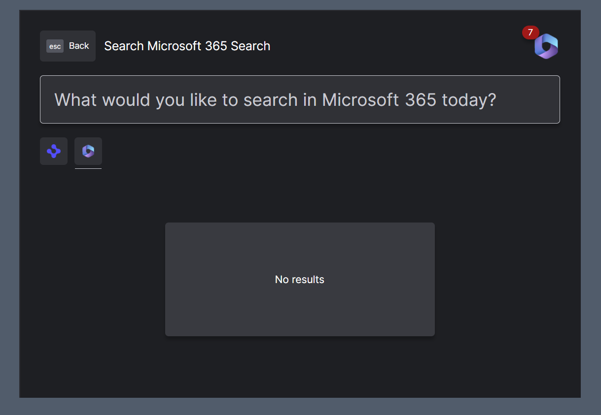

> **_:information_source: OpenFin Workspace:_** [OpenFin Workspace](https://www.openfin.co/workspace/) is a commercial product and this repo is for evaluation purposes (See [LICENSE.MD](../LICENSE.MD)). Use of the OpenFin Container and OpenFin Workspace components is only granted pursuant to a license from OpenFin (see [manifest](../public/manifest.fin.json)). Please [**contact us**](https://www.openfin.co/workspace/poc/) if you would like to request a developer evaluation key or to discuss a production license.
> OpenFin Workspace is currently **only supported on Windows** although you can run the sample on a Mac for development purposes.

[<- Back to Table Of Contents](../README.md)

# How To Setup Microflows ?

Workspace now includes support for low code workflows from version 13.1+ of OpenFin Workspace. Examples of how easy it is to enable these microflows can be found in [integrate-with-ms365-microflow](../integrate-with-ms365-microflow/) and [integrate-with-ms365-microflow-basic](../integrate-with-ms365-microflow-basic/) and in this example platform we have made it purely config based. For more information about Microflows please see [Working with OpenFin's Microsoft Microflow](https://developers.openfin.co/of-docs/docs/microflows-microsoft).



The code for the microflow provider can be found in [microflow.ts](../client/src/framework/workspace/microflow.ts), `register` is called as part of the app platform initialization as microflow integrations need to be passed as part of a platform's config. If you want microflow integrations registered after your own home registration then you can set your microflow entry to not auto initialize. If you want home to autoShow after registration (even if you have not got your own home registration) then remember to put autoShow: ["home"] in your bootstrap configuration and add it to the end of the array if there are multiple entries.

## Enabling Microflows

To enable microflows you need to add a microflowProvider section to your customSettings. We generate schemas that can be used in your manifest and settings.json file to give you intellisense (you can see an example in our main [manifest.fin.json](../public/manifest.fin.json)).

```json
"microflowProvider": {
   "microflows": [{
    "id": "ms365",
    "title": "Microsoft 365 Microflow Integration",
    "type": "MS365",
    "enabled": false,
    "data": {
     "connect": {
      "clientId": "",
      "tenantId": "",
      "redirectUri": ""
     },
     "workflows": {
      "search": {
       "disableAutoInitialize": true
      }
     }
    }
   }]
  }
```

In the example above we have provided the microflows array with a single entry. This entry is to use the MS365 microflow (specified via the type) and the data within it is the settings required when registering a Microflow. In the example of the Microsoft 365 Microflow you still need to ensure you have the Microsoft tenant and all the related permissions setup. Please see [Working with OpenFin's Microsoft Microflow](https://developers.openfin.co/of-docs/docs/microflows-microsoft). You'll notice we have specified disableAutoInitialize. This is because we want the Microflow home registration to appear after our own home registration icon:

```json
"microflowProvider": {
   "microflows": [{
    ...
     "workflows": {
      "search": {
       "disableAutoInitialize": true
      }
     }
   }]
  }
```

There are a number of settings you can specify to customize the setup of the Microflow. Please see our website documentation for more details.

To have home show up after the registration please ensure that you have autoShow set to show home in the bootstrap configuration.

```json
"bootstrap": {
    "autoShow": ["home"]
}
```

## Source Reference

- [platform.ts](../client/src/framework/platform/platform.ts) - where we take the custom settings and register microflow integrations as part of the platform
- [microflow.ts](../client/src/framework/workspace/microflow.ts) - where the settings are passed and the microflows instantiated
- [bootstrap.ts](../client/src/framework/platform/platform.ts) - where we initialize any microflows that have disableAutoInitialize set to true after the platform's own home registration has been applied

[<- Back to Table Of Contents](../README.md)
