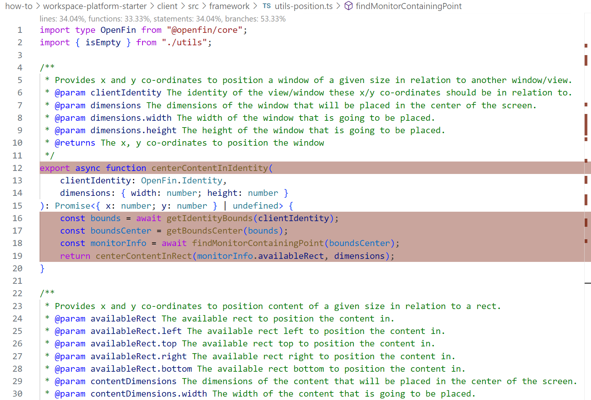

> **_:information_source: OpenFin Workspace:_** [OpenFin Workspace](https://www.openfin.co/workspace/) is a commercial product and this repo is for evaluation purposes (See [LICENSE.MD](../LICENSE.MD)). Use of the OpenFin Container and OpenFin Workspace components is only granted pursuant to a license from OpenFin (see [manifest](../public/manifest.fin.json)). Please [**contact us**](https://www.openfin.co/workspace/poc/) if you would like to request a developer evaluation key or to discuss a production license.

[<- Back to Table Of Contents](../README.md)

# How To Test Your Platform Code

Unit testing should be performed on your code to improve its correctness, there are some example tests included to demonstrate how to achieve this goal in the OpenFin environment.

There is an npm command which will execute the included tests.

```shell
npm run test
```

The tests are executed using Jest as the test runner, the configuration is setup so that it will test TypeScript files and include code coverage.

Included in the project are some example tests, see [../test](../test/) folder.

Example output from running the tests using the npm command:


## Testing in VSCode

You can also run and debug the tests from inside VSCode, you must first install the following plugin [Jest](https://marketplace.visualstudio.com/items?itemName=Orta.vscode-jest)

By selecting the flask icon on the left you should see all the tests available and be able to run or debug them as a whole or individually. This includes being able to set breakpoints in them in debug mode.


## Code Coverage

Code coverage is enabled for Jest, if you open a source file that you have been testing, and switch on the VSCode Code Coverage option you should see a display similar to the following, which highlights areas which have not been covered by the tests.



## Setup and Mocking

As part of your testing you will no doubt need to mock parts of the fin API, you can see an examples of this in the [../test/setup.ts](../test/setup.ts)

The `setup.ts` file is always executed when running the tests, so anything you define in there will be available to all of your tests.

e.g. Mocking the `fin.System.getMonitorInfo` method

```ts
Object.defineProperty(globalThis, 'fin', {
  value: {
    System: {
      getMonitorInfo: async () => ({
        primaryMonitor: {
          monitorRect: PRIMARY_MONITOR_RECT
        },
        nonPrimaryMonitors: [
          {
            monitorRect: SECONDARY_MONITOR_RECT
          },
          {
            monitorRect: TERTIARY_MONITOR_RECT
          }
        ]
      })
    }
  }
});
```

[<- Back to Table Of Contents](../README.md)
