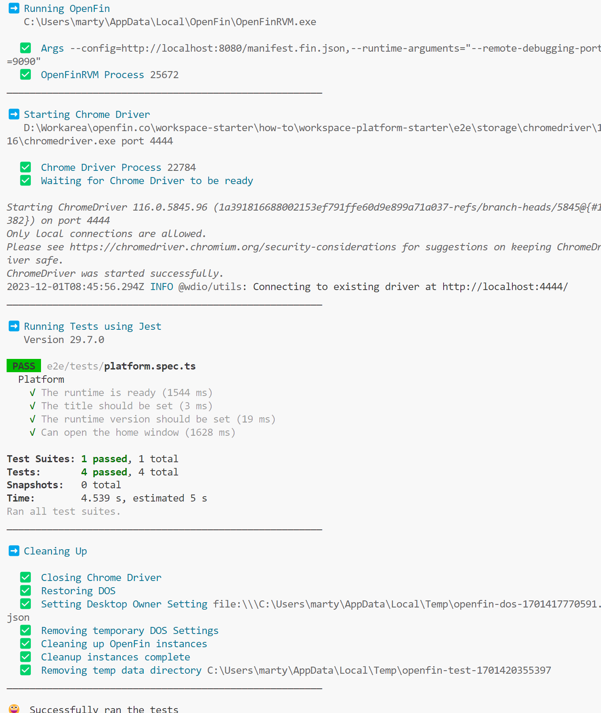

> **_:information_source: OpenFin Workspace:_** [OpenFin Workspace](https://www.openfin.co/workspace/) is a commercial product and this repo is for evaluation purposes (See [LICENSE.MD](../LICENSE.MD)). Use of the OpenFin Container and OpenFin Workspace components is only granted pursuant to a license from OpenFin (see [manifest](../public/manifest.fin.json)). Please [**contact us**](https://www.openfin.co/workspace/poc/) if you would like to request a developer evaluation key or to discuss a production license.

[<- Back to Table Of Contents](../README.md)

# How To Test Your UI

Testing your OpenFin platform UI can be achieved using the OpenFin Automation tools.

For more information on the OpenFin automation tools see the following packages.

- [@openfin/automation-cli](https://www.npmjs.com/package/@openfin/automation-cli)
- [@openfin/automation-helpers](https://www.npmjs.com/package/@openfin/automation-helpers)

There is an npm command which will execute the included e2e tests.

```shell
npm run e2e
```

You must first make sure the local web server is serving the manifest for the application using the `npm run start` script.

The tests are executed using Jest as the test runner, the example tests are in the [../e2e](../e2e/) folder.

Example output from running the tests using the npm command:



[<- Back to Table Of Contents](../README.md)
