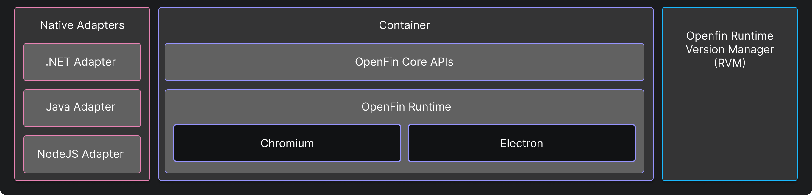

> **_:information_source: HERE Core UI:_** [HERE Core UI](https://resources.here.io/docs/core/hc-ui/) is a commercial product and this repo is for evaluation purposes (See [LICENSE.MD](../LICENSE.MD)). Use of the HERE Core Container and HERE Core UI components is only granted pursuant to a license from HERE (see [manifest](../public/manifest.fin.json)). Please [**contact us**](https://www.here.io/contact) if you would like to request a developer evaluation key or to discuss a production license.

[<- Back to Table Of Contents](../README.md)

# What Is Container?

Container is the foundation on which all HERE apps are built. Workspace platforms are built on top of a solid foundation. This foundation is made up of the:

- [RVM (Runtime Version Manager)](https://developers.openfin.co/of-docs/docs/rvm) - This application is used in the initial installation and manages the launching and fetching of HERE runtimes. If your HERE Core UI Platform manifest is updated and references a version of the HERE runtime that isn't available it will fetch it from the HERE CDN (unless [Desktop Owner Settings (DOS)](https://resources.here.io/docs/core/manage/desktops/dos/) are used).
- Container is the HERE runtime (which is a combination of Chromium, Electron and our HERE APIs which are injected into your HTML document). The container is what gives HERE applications the ability to communicate seamlessly with each other as well as native applications. The container also allows you to provide a Native experience to your HTML based applications. A version of Workspace is paired against a runtime. The HERE APIs give you access to functionality you wouldn't have in the browser. More information can be found here: [Container Overview](https://developers.openfin.co/of-docs/docs/container-overview)
- [Native Adapters](https://developers.openfin.co/of-docs/docs/overview-of-net-and-java) are optional. They are there if you wish to integrate a native application with your HERE Core UI Platform or if you want to extend the capability of your HERE Core UI Platform through native extensions.

[<- Back to Table Of Contents](../README.md)
