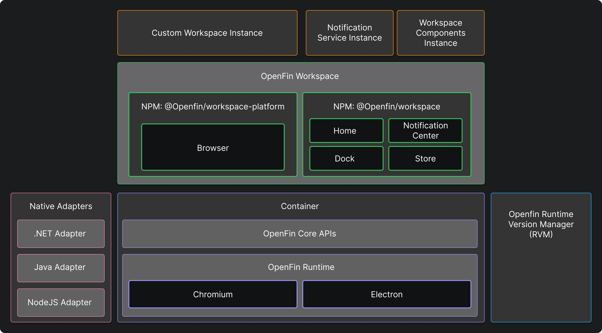
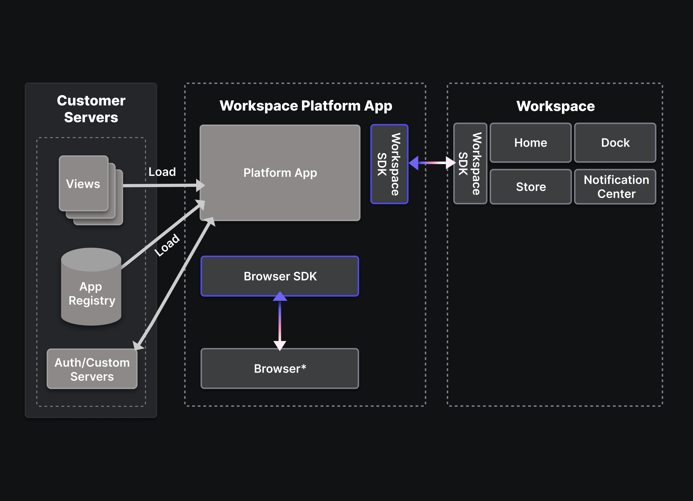

> **_:information_source: HERE Core UI:_** [HERE Core UI](https://resources.here.io/docs/core/hc-ui/) is a commercial product and this repo is for evaluation purposes (See [LICENSE.MD](../LICENSE.MD)). Use of the HERE Core Container and HERE Core UI components is only granted pursuant to a license from HERE (see [manifest](../public/manifest.fin.json)). Please [**contact us**](https://www.here.io/contact) if you would like to request a developer evaluation key or to discuss a production license.

[<- Back to Table Of Contents](../README.md)

# What Is A HERE Core UI Platform?

A HERE Core UI Platform and it's use of the Browser component is it's own HERE application running under it's own process, Notification Center is another HERE application running under it's own process and Dock, Store and Home UI fall under a Workspace application under it's own process.

The HERE Core UI Platform takes advantages of your servers to serve content, provide data (e.g. apps) or provide authentication. The following image may help to visualize it:

By looking at [container](./what-is-container.md) and [workspace](./what-is-workspace.md) you can see that you have the ability to build a rich user experience using OpenFin's offering.

If you have:

- Specific requirements
- Enough dev resources
- Experience of building platforms
- Time

Then you could take the starters in this repo and this how-to and use it as guidance for your PoC (Proof of Concept)/PoV (Proof of Value) and then start fresh with a fresh codebase when you are done.

If you wish to validate functionality and you want to get up and running quickly then you can use workspace-platform-starter. This is a HERE Core UI Platform that has been built to let you get setup with a number of defaults while still allowing you a number of extension points that you can define via settings.

The workspace-platform-starter platform allows you to have a platform in a box. It will not give you as much flexibility and power as building a platform yourself using the [workspace](./what-is-workspace.md) npm packages directly but it gives you an opinionated way of running a platform that can be extended by you or other teams within your organization.

The documentation in this folder covers general concepts but the guides are built with workspace-platform-starter in mind.

[<- Back to Table Of Contents](../README.md)
