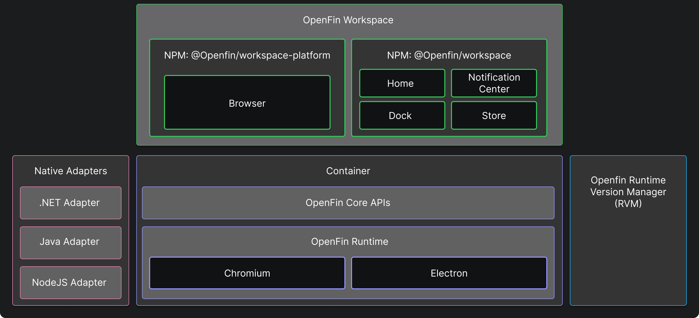

> **_:information_source: HERE Core UI:_** [HERE Core UI](https://resources.here.io/docs/core/hc-ui/) is a commercial product and this repo is for evaluation purposes (See [LICENSE.MD](../LICENSE.MD)). Use of the HERE Core Container and HERE Core UI components is only granted pursuant to a license from HERE (see [manifest](../public/manifest.fin.json)). Please [**contact us**](https://www.here.io/contact) if you would like to request a developer evaluation key or to discuss a production license.

[<- Back to Table Of Contents](../README.md)

# What Is Workspace?

Workspace is a set of UI Components that you can reference from your HERE Core UI Platform. They build on top of [container](./what-is-container.md) and can be used by referencing a set of NPM packages.

Each component serves a purpose and whether or not you decide to utilize all of them in your HERE Core UI Platform is down to your needs.

## @openfin/workspace

The workspace package allows you to register against and provide functions for:

- Notification Center
- Home
- Store
- Dock

These components do not fall under your application and are singleton instances on the desktop that HERE Core UI Platforms can register against.

## @openfin/workspace-platform

The HERE Core UI Platform npm module provides you with the option of initiating a platform (this is a superset of the standard HERE platform found in container) and providing overrides for your platform (such as theming options for your platform and HERE Core UI Components and overrides for the browser component that workspace offers).

The browser component does fall under your HERE Core UI Platform and is specific to your application.

With these NPM packages and the HERE runtime you can build a custom HERE Core UI Platform specific to your needs.

If you are looking for an example of what a complete HERE Core UI Platform looks like then you have come to the right place. See [What is a HERE Core UI Platform](./what-is-workspace-platform.md)

For more information about HERE Core UI please see the [Workspace Overview](https://developers.openfin.co/of-docs/docs/overview-of-workspace)

[<- Back to Table Of Contents](../README.md)
