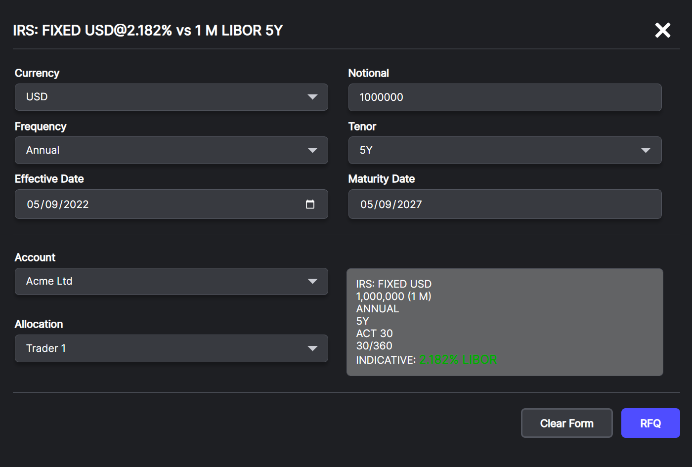
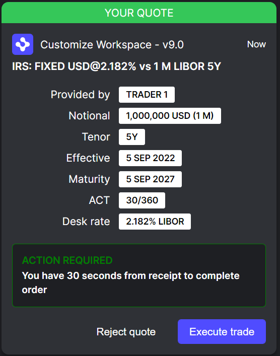
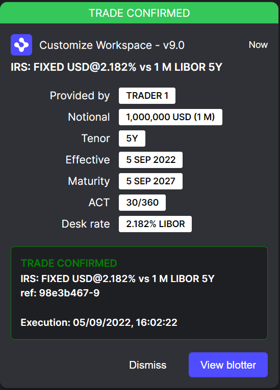
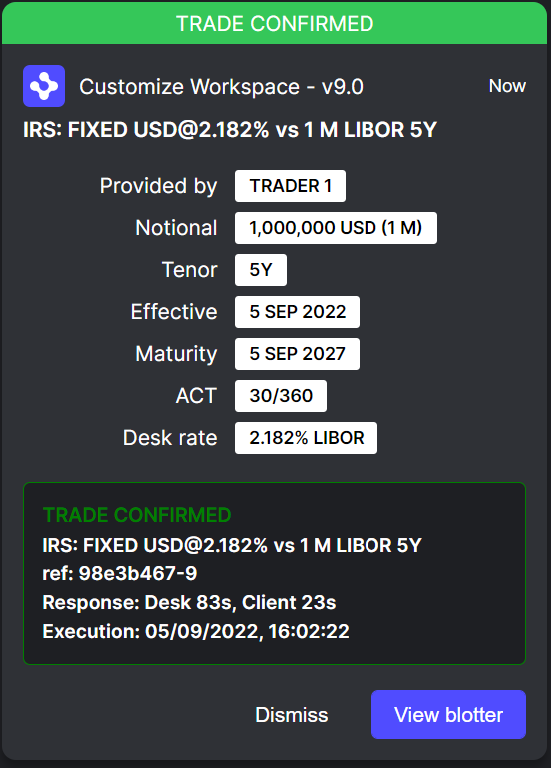

# Interest Rate Swap - Request For Quote

This example demonstrates an Interest Rate Swap - Request For Quote, the workflow is triggered from an input form as follows.

Fill in a `Notional` value and click `RFQ`.

This will trigger a request from the client to the trading desk.

The trader persona will then receive a notification of an Inbound Request for Quote.

The View blotter` action currently has no operation, other than to end the workflow.

If you as the trader click `Accept Rate & Response` a message is sent back to the client that the quote was accepted.

We wait for 5 seconds and in the background simulate the acceptance, before sending the client confirmation of their quote.

As a client you have 30 seconds to either `Reject quote` which terminates the workflow or `Execute trade` which tells the trader to continue. After 30s the workflow will automatically terminate if no action has been performed.

If you have opted to execute the quote we wait 5 seconds and then send the Trade Confirmed notification back to the client, with a `ref` and `Execution` included.

Both the `Dismiss` and `View blotter` do nothing from the clients perspective other than end the workflow.

After 5 seconds a notification will be shown to the trader giving them final details on the order. This includes the time to execute for both the Desk and the Client.

Clicking `Dismiss` or `View Blotter` ends the workflow.
